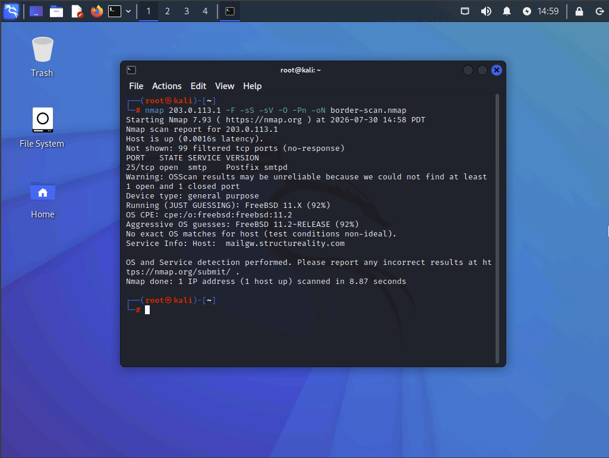
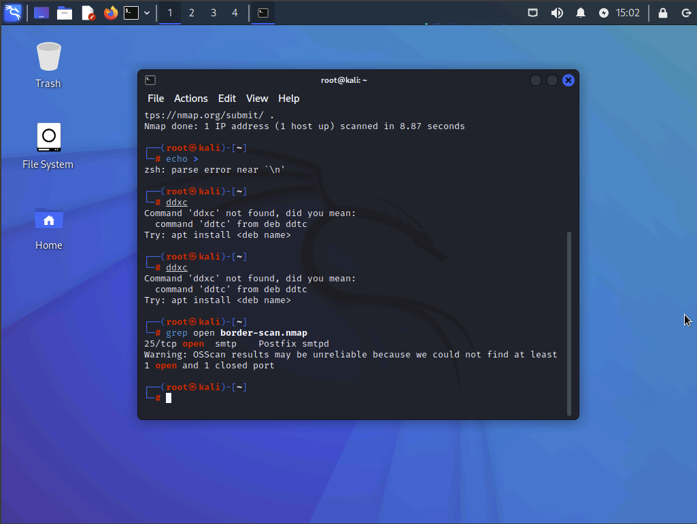
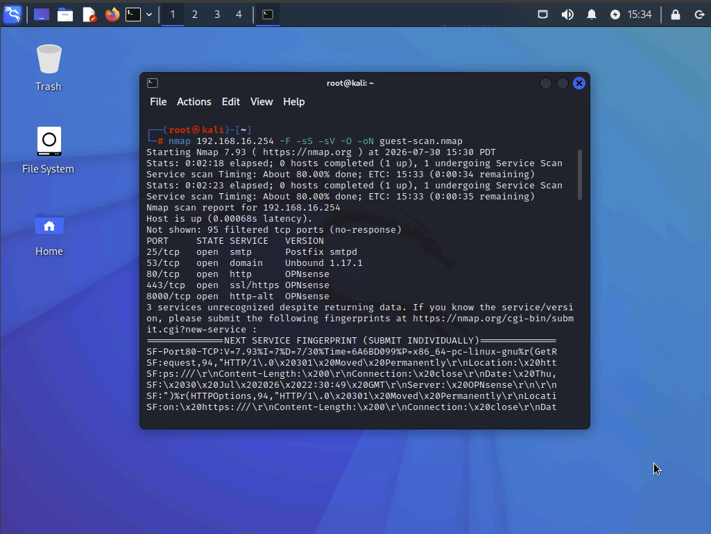
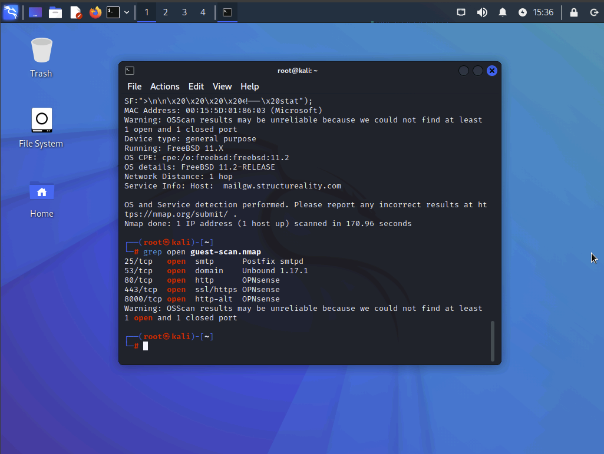
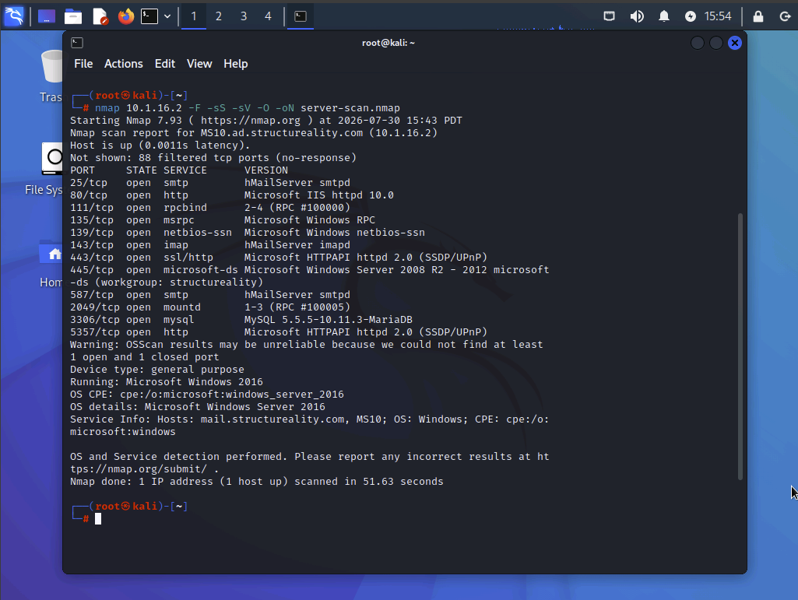
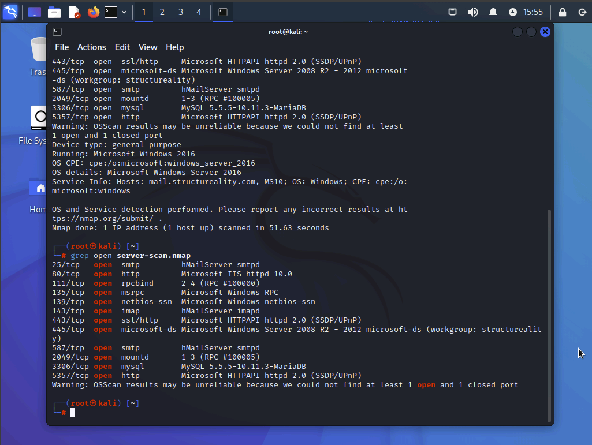
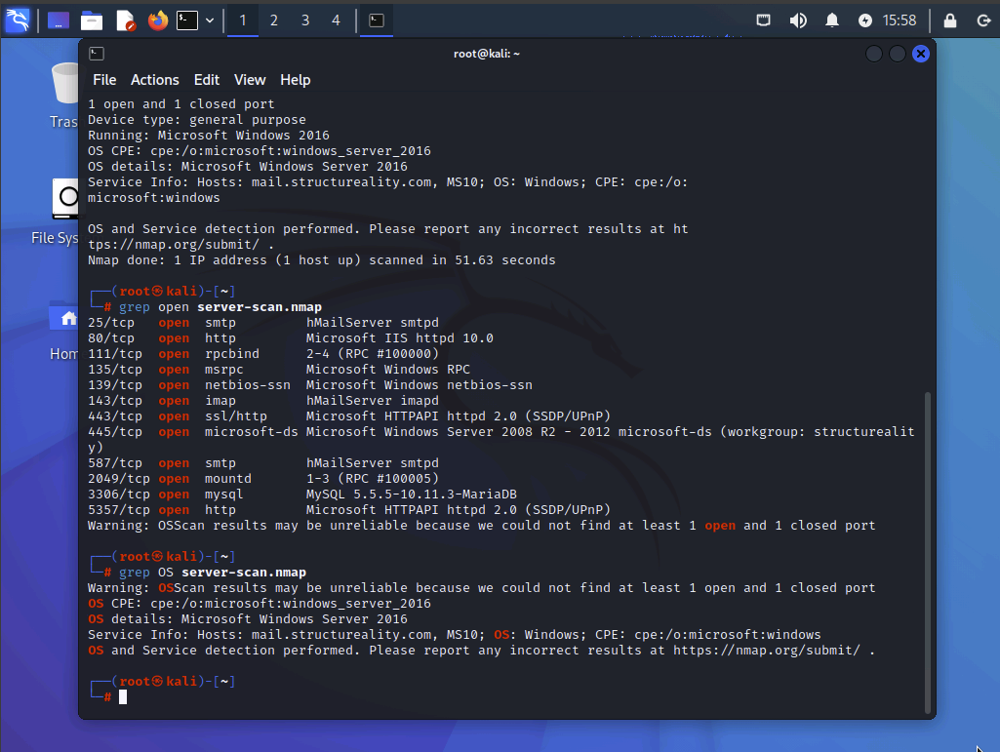

# Finding Open Service Ports

## Objective

Perform network reconnaissance using Nmap to identify open service ports, enumerate running services, detect operating systems, and evaluate the attack surface of systems from multiple network locations. This lab demonstrates how exposed services can increase risk and highlights the importance of reducing unnecessary attack surfaces.

## Environment

- **Platform:** CompTIA CertMaster Labs
- **Operating System:** Kali Linux
- **Systems & Networks:**
  - Kali Linux Workstation
  - Internet Simulation Network
  - Guest Network
  - Client Network
  - Server Network
- **Tools & Technologies:**
  - Nmap
  - Kali Linux Terminal
  - Linux Networking Commands (`ip`, `dhclient`)
  - TCP Port Scanning
  - Service Enumeration
  - Operating System Detection

## Lab Overview

This lab used Nmap to perform reconnaissance against systems from three different network locations. Scans were conducted against an internet-facing firewall, a guest network gateway, and an internal server to identify exposed ports, enumerate services, detect operating systems, and assess potential attack surfaces.

## Steps Performed

### Internet-Facing Firewall Assessment

Performed an Nmap SYN scan against the organization's simulated border firewall to identify externally exposed services.

- Scanned the top 100 TCP ports using a SYN scan.
- Enumerated running services and detected the target operating system.
- Reviewed exposed services that could increase the organization's external attack surface.
- Saved scan results for later analysis.

**Border firewall Nmap scan**

**Discovered open ports**

---

### Guest Network Assessment

Evaluated the attack surface from the perspective of a device connected to the guest network.

- Reconfigured the network interface to connect to the guest network.
- Performed an Nmap scan against the guest network gateway.
- Identified firewall management services exposed to guest users.
- Evaluated the security implications of management interfaces being accessible from an untrusted network.

**Guest network Nmap scan**

**Guest network open services**

---

### Internal Network Assessment

Analyzed the attack surface of an internal Windows server from the client network.

- Connected the workstation to the client subnet.
- Performed service enumeration against an internal server.
- Identified multiple exposed network services.
- Observed the lack of network segmentation between client and server networks.
- Reviewed operating system detection results.

**Internal server Nmap scan**

**Internal server open services**

**Operating system detection**

---

### Network Interface Verification

Verified the workstation successfully obtained a new IP configuration after changing network segments.

**Network interface configuration**

---

## Results

Successfully performed reconnaissance and service enumeration against systems from multiple network locations.

| Assessment | Findings |
|------------|----------|
| **Internet-Facing Firewall** | Identified externally accessible services and detected the target operating system, demonstrating how internet-exposed ports increase the external attack surface. |
| **Guest Network** | Discovered firewall management services accessible from the guest network, highlighting an unnecessary security risk. |
| **Internal Server** | Identified multiple exposed services and observed a lack of network segmentation between client and server networks, increasing the potential internal attack surface. |

## Skills Demonstrated

- Network reconnaissance using Nmap
- TCP SYN port scanning
- Service enumeration
- Operating system fingerprinting
- Attack surface analysis
- Network segmentation assessment
- Identification of exposed management interfaces
- Security assessment of internet-facing and internal systems

## Key Takeaways

- Nmap is an industry-standard reconnaissance tool for discovering hosts, open ports, services, and operating systems.
- Every exposed service represents a potential attack vector and should be reviewed to determine whether it is necessary.
- Internet-facing systems should expose only the minimum required services to reduce the organization's external attack surface.
- Administrative interfaces should not be accessible from untrusted networks such as guest Wi-Fi.
- Network segmentation helps reduce opportunities for lateral movement between clients and servers.
- Regular port scanning and service enumeration are valuable practices for identifying unnecessary exposure and improving an organization's security posture.