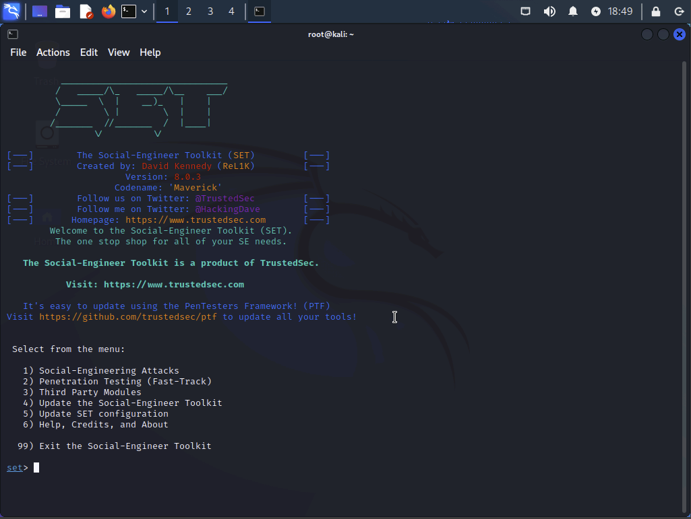
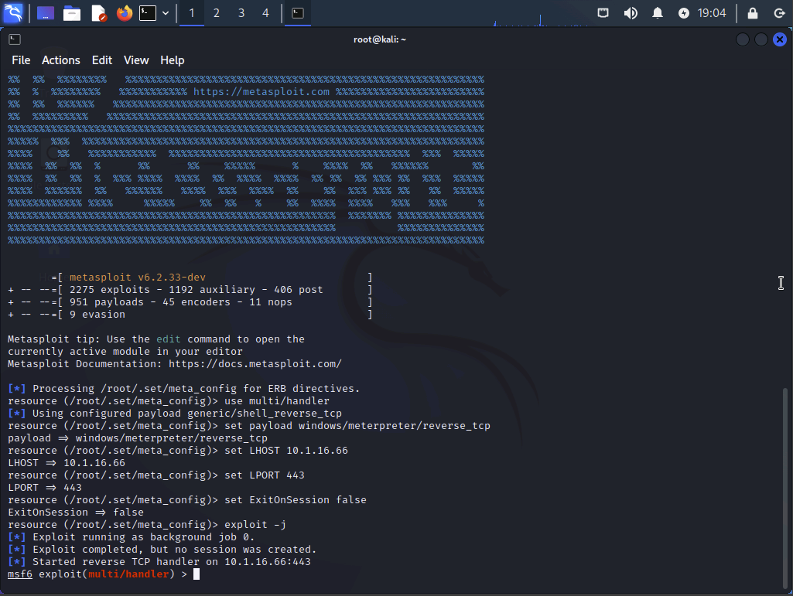
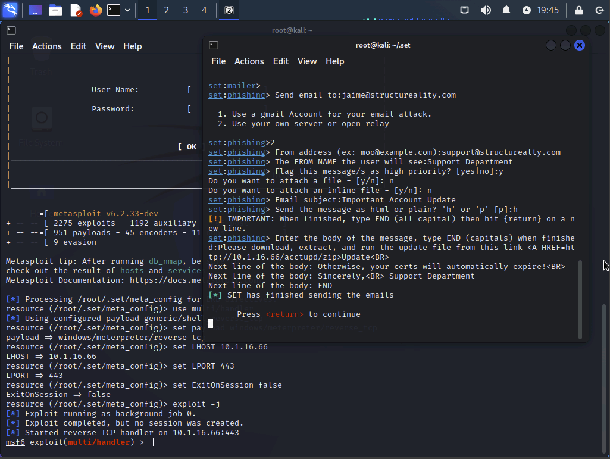
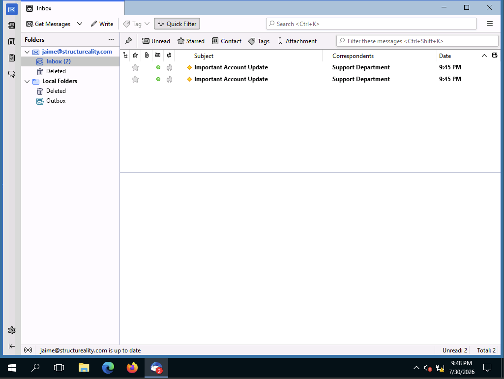

# Using SET to Perform Social Engineering

> **Note:** This activity was performed within an isolated lab environment as part of authorized cybersecurity training to better understand social engineering techniques and improve defensive security awareness.

## Objective

Use the Social-Engineer Toolkit (SET) to simulate a spear phishing attack by generating a malicious payload, configuring a listener, crafting a phishing email, and evaluating the stages of a social engineering attack within a controlled lab environment.

## Environment

* **Platform:** CompTIA CertMaster Labs
* **Attacker System:** Kali Linux
* **Target System:** Windows Server 2016 (MS10)
* **Tools & Technologies:**

  * Social-Engineer Toolkit (SET)
  * Metasploit Framework (Meterpreter)
  * Apache Web Server
  * Thunderbird Email Client
  * HTML Email
  * Reverse TCP Payload

## Lab Overview

This lab explored the Social-Engineer Toolkit (SET) by simulating a spear phishing campaign in a controlled lab environment. The exercise involved generating a Meterpreter payload, configuring a reverse shell listener, hosting the payload for download, crafting a spoofed phishing email, and delivering it to a simulated user. Although the phishing email was successfully delivered, the reverse shell session was not successfully established during the execution phase.

## Steps Performed

### Exploring the Social-Engineer Toolkit

Reviewed the capabilities of SET and explored the available social engineering attack vectors.

* Navigated the SET menu-driven interface.
* Explored spear phishing, website attack, payload generation, wireless, PowerShell, and hardware-based attack modules.
* Reviewed the available options used to build simulated social engineering campaigns.

**SET Social Engineering menu**

---

### Configuring the Payload and Listener

Configured SET to generate a Windows Reverse TCP Meterpreter payload and prepare a listener for an incoming reverse shell connection.

* Generated a Windows Meterpreter reverse TCP payload.
* Configured the listener with the attacker's IP address and listening port.
* Started the Metasploit multi/handler listener.
* Prepared the payload for delivery by packaging it into a ZIP archive and hosting it through Apache.

**Meterpreter listener configured**

---

### Creating and Sending the Phishing Email

Created a spoofed phishing email designed to persuade the recipient to download the hosted payload.

* Configured a spoofed sender address and display name.
* Created an HTML email containing a malicious download link.
* Sent the phishing message using SET's Mass Mailer module.

**Phishing email successfully sent**

---

### Simulating the Target User

Verified that the phishing email reached the target user's inbox.

* Opened the victim's email client.
* Confirmed receipt of the phishing email.
* Reviewed the embedded download link from the recipient's perspective.

**Phishing email received by the target**

---

## Results

The phishing simulation was successfully configured through SET, including payload generation, listener configuration, payload hosting, and email delivery. The phishing email was successfully received by the simulated target.

During the execution phase, the reverse shell payload did not successfully establish a Meterpreter session within the lab environment. Consequently, post-exploitation activities such as interacting with the compromised system and collecting system information could not be completed.

Despite the incomplete execution, the lab provided practical experience with the planning, configuration, and delivery stages of a simulated phishing attack and reinforced the importance of user awareness as a critical defense against social engineering.

## Skills Demonstrated

* Social engineering awareness
* Spear phishing simulation
* Social-Engineer Toolkit (SET)
* Meterpreter payload generation
* Reverse TCP listener configuration
* HTML phishing email creation
* Email spoofing concepts
* Payload hosting with Apache
* Social engineering attack workflow
* Security awareness assessment

## Key Takeaways

* Social engineering attacks rely on both technical tools and psychological manipulation to persuade users to perform unsafe actions.
* SET provides an integrated framework for simulating phishing campaigns and other social engineering techniques during authorized security assessments.
* Convincing phishing emails can be created using spoofed sender information and realistic messaging, reinforcing the importance of user awareness training.
* Security awareness education remains one of the most effective defenses against phishing attacks.
* Accurate documentation of both successful outcomes and unexpected issues is an important part of professional cybersecurity practice.
