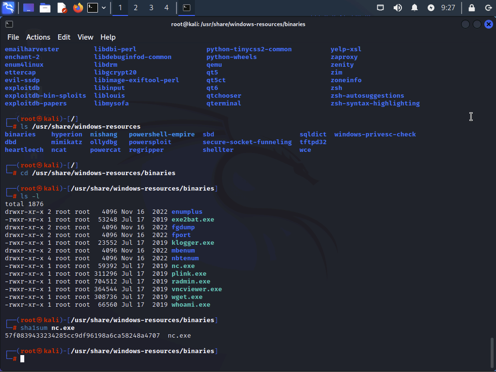
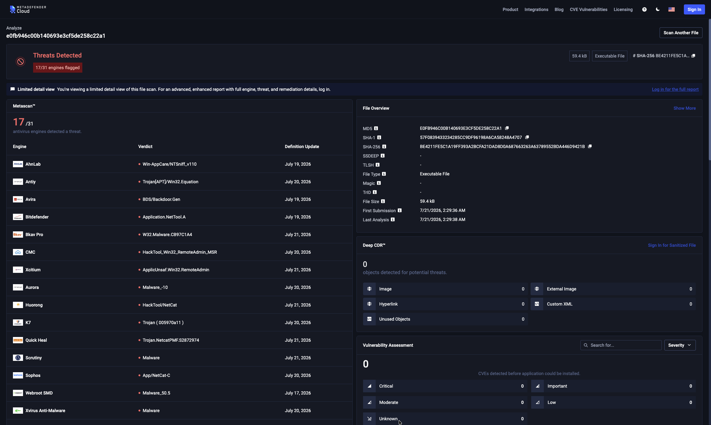
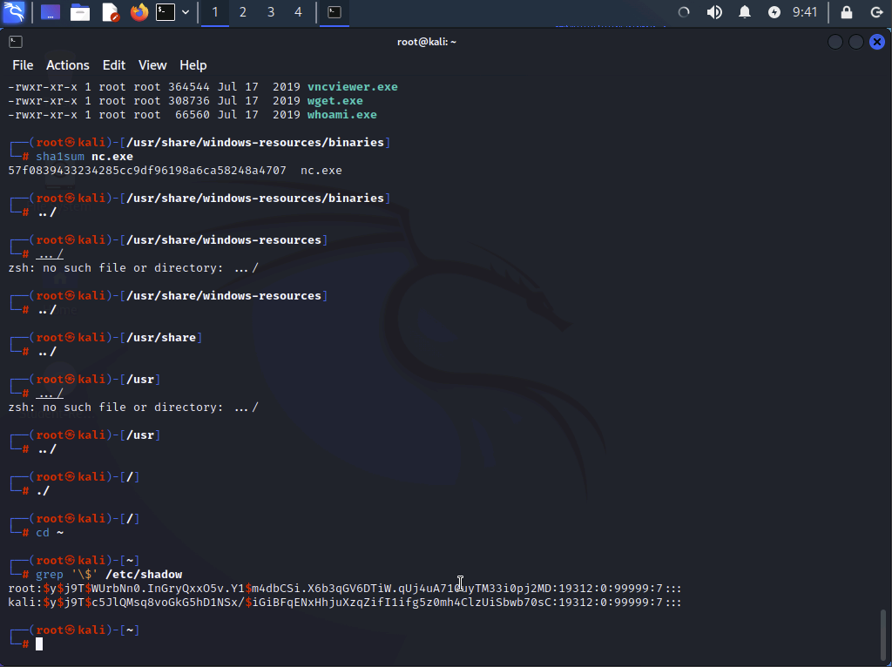
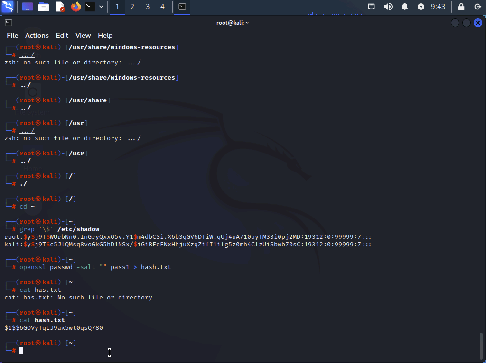
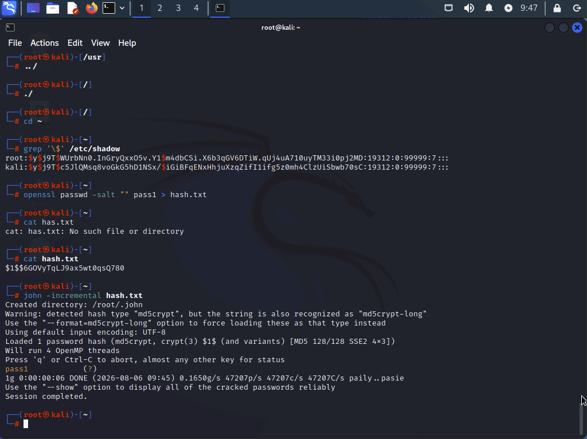
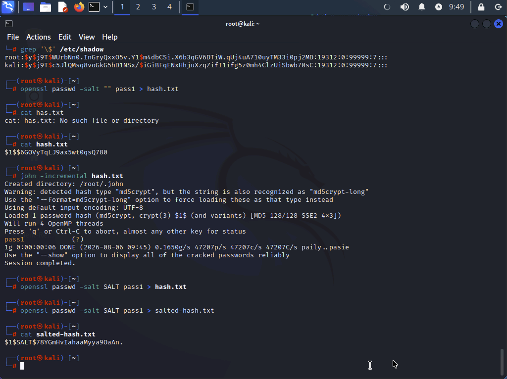
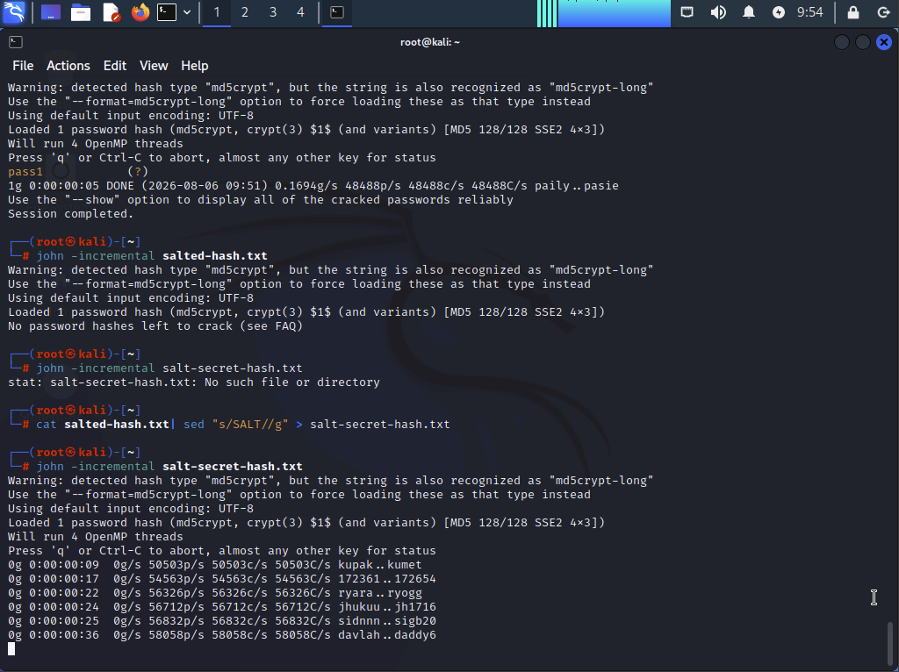

# Using Hashing and Salting

## Overview

This lab demonstrates how hashing and salting are used to protect data integrity and password security. The exercises cover generating file hashes, validating suspicious files using an online malware analysis service, creating salted and unsalted password hashes, and observing how salting dramatically increases the difficulty of brute-force password cracking.

## Objectives

- Generate and verify file hashes
- Evaluate suspicious files using MetaDefender Cloud
- Explore Linux password hashes stored in `/etc/shadow`
- Create salted and unsalted password hashes with OpenSSL
- Compare brute-force attacks against salted and unsalted hashes using John the Ripper
- Understand why salting improves password security

---

## Lab Environment

- **Platform:** Skillable Virtual Lab
- **Operating System:** Kali Linux
- **Primary Tools:**
  - sha1sum
  - OpenSSL
  - John the Ripper
  - MetaDefender Cloud
  - grep
  - cat
  - sed

---

# Part 1 – Generate a SHA1 File Hash

Navigated to the directory containing Windows resource binaries and generated a SHA1 hash for the `nc.exe` file using the `sha1sum` command.

**Screenshot**

---

# Part 2 – Verify the Hash with MetaDefender

Submitted the SHA1 hash to MetaDefender Cloud to identify the file and review detection results from multiple malware scanning engines.

**Screenshot**

---

# Part 3 – View Salted Password Hashes

Viewed the password entries stored in `/etc/shadow` to observe how Linux stores password hashes with embedded salts and hashing algorithm identifiers.

**Screenshot**

---

# Part 4 – Create an Unsalted Password Hash

Generated an MD5 password hash without using a salt and displayed the resulting hash stored in `hash.txt`.

**Screenshot**

---

# Part 5 – Brute Force the Unsalted Hash

Used John the Ripper to crack the unsalted password hash. Because no salt was present, the password was recovered almost immediately.

**Screenshot**

---

# Part 6 – Create a Salted Password Hash

Generated a new password hash using the salt value `SALT` and verified that the salt appeared within the stored hash.

**Screenshot**

---

# Part 7 – Attempt to Crack a Salted Hash Without the Salt

Removed the visible salt from the hash and launched John the Ripper against the modified hash. The estimated cracking time increased dramatically, illustrating how salting significantly increases resistance to brute-force attacks.

**Screenshot**

---

# Security Concepts Demonstrated

- File integrity verification using cryptographic hashes
- Malware identification through hash reputation services
- Password hashing fundamentals
- Salted vs. unsalted password storage
- Brute-force password attacks
- Why Linux salts password hashes by default
- MD5 weaknesses and why stronger hashing algorithms are preferred
- Defense against rainbow table attacks

---

# Key Takeaways

- Hashing verifies data integrity by detecting unauthorized modifications.
- Hash reputation services can identify known malicious or suspicious files without requiring the file itself to be uploaded.
- Salting makes identical passwords generate unique hashes.
- Password salts dramatically increase the computational cost of brute-force attacks.
- Modern password storage should use strong password hashing algorithms (such as bcrypt, scrypt, Argon2, or yescrypt) instead of MD5.
- Even a short salt greatly increases the number of password combinations an attacker must attempt.

---

## Skills Demonstrated

- File integrity verification
- Cryptographic hashing
- Malware hash analysis
- Linux command-line operations
- Password security concepts
- Password cracking demonstrations
- Security analysis and validation