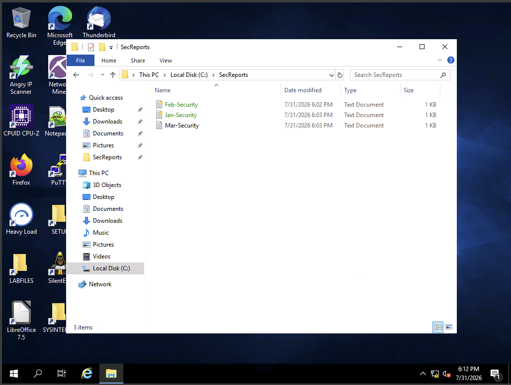
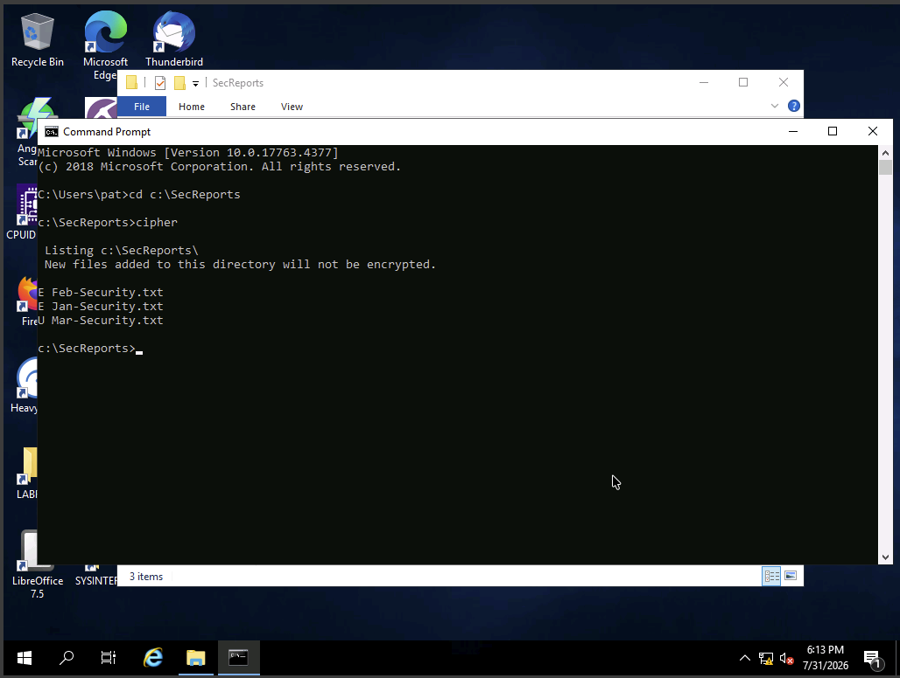
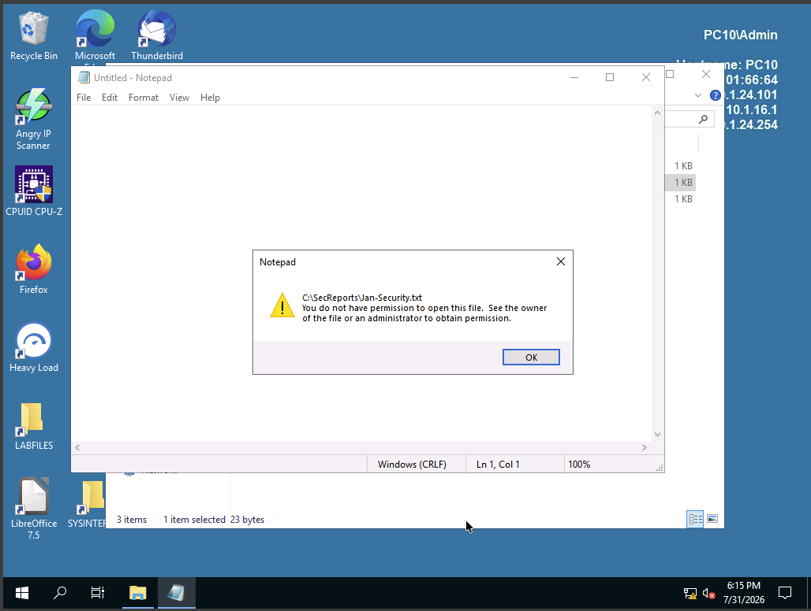
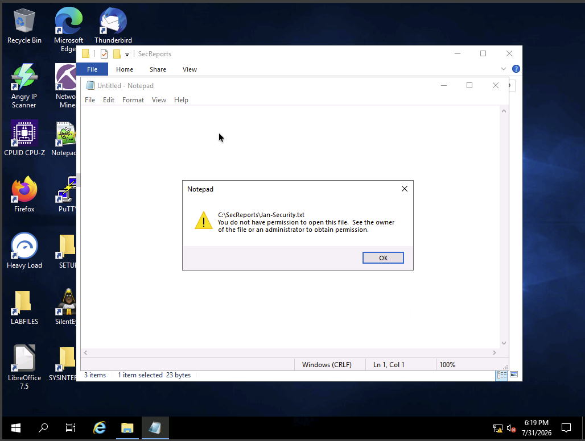
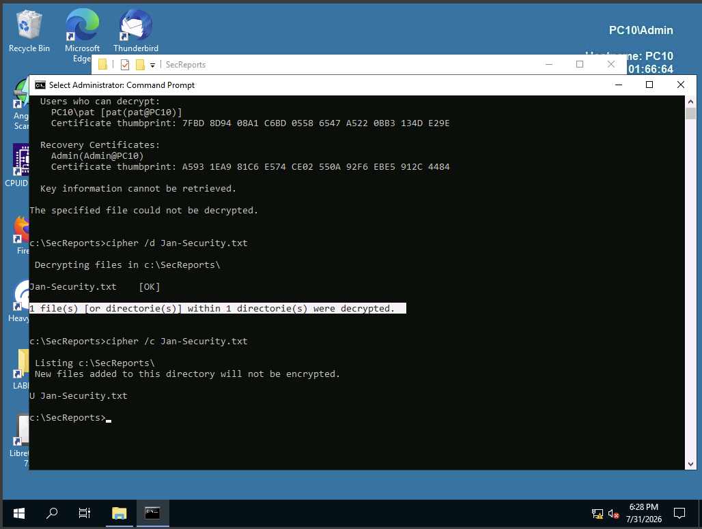
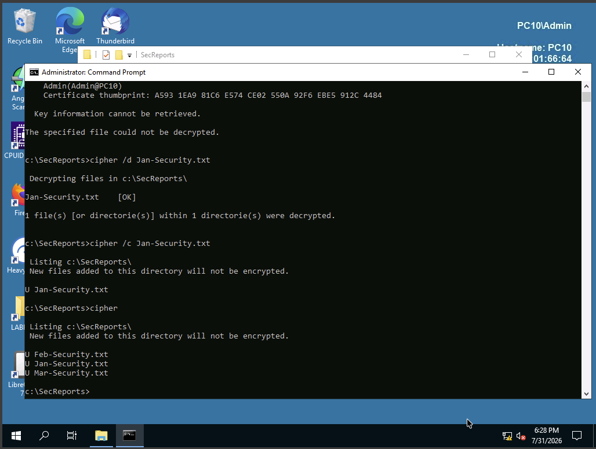
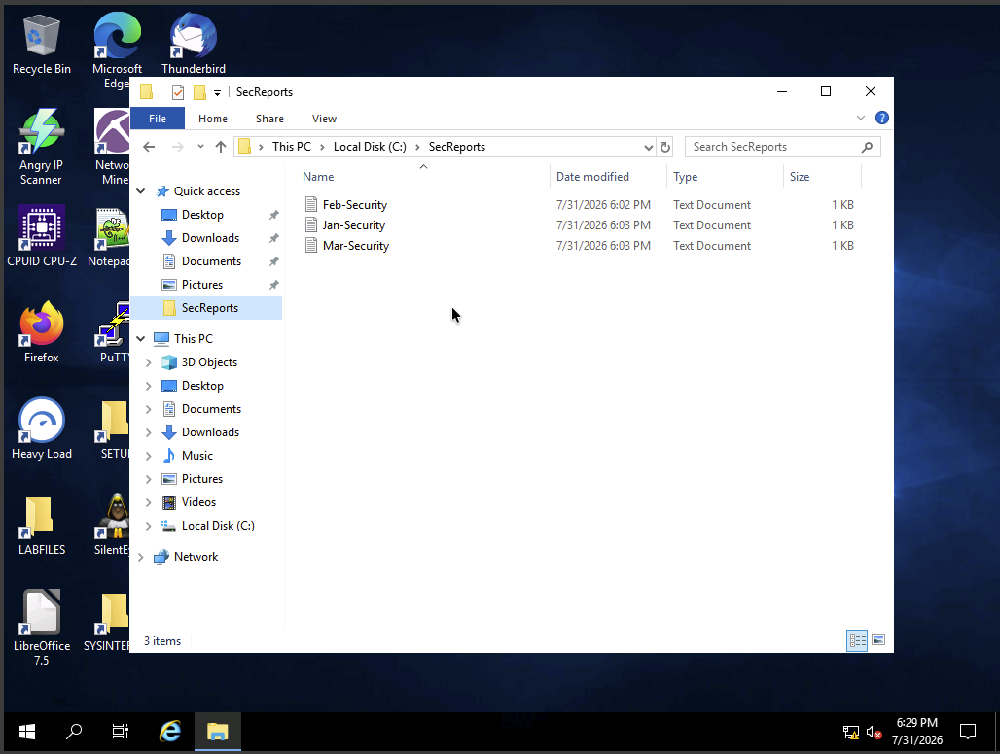

# Using Storage Encryption

## Overview

This lab demonstrates how Windows Encrypting File System (EFS) protects individual files through encryption and how an Encryption File System Data Recovery Agent (DRA) can recover encrypted data when a user permanently loses access to their encryption keys.

During the lab, I configured an EFS Data Recovery Agent, encrypted files using both the Windows GUI and command-line tools, intentionally caused a user to lose access to encrypted files after an administrative password reset, and successfully restored access using the configured Data Recovery Agent.

---

## Objectives

- Configure an EFS Data Recovery Agent (DRA)
- Encrypt files using Windows Encrypting File System (EFS)
- Verify encryption through both GUI and command-line tools
- Demonstrate loss of EFS access following an administrative password reset
- Recover encrypted files using the configured Data Recovery Agent
- Understand enterprise recovery procedures for encrypted data

---

# Lab Environment

- **Platform:** Skillable Virtual Lab
- **Operating System:** Windows Server 2019 (PC10)
- **Tools Used:**
  - Windows Encrypting File System (EFS)
  - Cipher
  - PowerShell
  - Local Security Policy
  - File Explorer
  - Command Prompt
  - Certificate Manager

---

# Skills Demonstrated

- Encrypting files with EFS
- Managing EFS Recovery Agent certificates
- Using command-line encryption tools
- Verifying encryption status
- Understanding EFS key dependency
- Recovering encrypted files through a Data Recovery Agent
- Windows certificate management
- Windows file security administration

---

# Lab Walkthrough

## 1. Creating the EFS Data Recovery Agent

An EFS Data Recovery Agent certificate was created before encrypting any files. This recovery certificate allows authorized administrators to recover encrypted files if a user's EFS private key becomes unavailable.

---

## 2. Encrypting Files with EFS

Three security report files were created. One file was encrypted through the Windows graphical interface while the remaining files were managed using the `cipher` command-line utility.

Encrypted files displayed the Windows EFS indicators, confirming successful encryption.

---

## 3. Verifying Encryption Status

The Windows `cipher` utility was used to verify which files were encrypted and which remained unencrypted.

This demonstrated how administrators can quickly audit EFS protection from the command line.

---

## 4. Verifying Access Restrictions

After signing in as a different administrative user, attempts to open encrypted files failed because that account did not possess the required EFS private key.

This demonstrated that NTFS permissions alone are insufficient to access EFS-protected files.

---

## 5. Simulating Loss of the User's EFS Key

The user's password was changed by an administrator, causing Windows to discard the original EFS private key associated with that account.

Although the user successfully logged in using the new password, access to previously encrypted files was permanently lost.

---

## 6. Recovering Data Using the Data Recovery Agent

After importing the Data Recovery Agent's private key, encrypted files were successfully decrypted using the `cipher` utility.

This demonstrated the purpose of configuring a DRA before encrypting enterprise data.

---

## 7. Verifying Recovery

The encryption status was checked again after recovery, confirming that previously encrypted files had been successfully restored to an accessible state.

---

## 8. Confirming User Access

After recovery was completed, the original user successfully opened the recovered files, demonstrating that access to the protected data had been restored.

---

# Key Takeaways

- EFS encrypts individual files while leaving the remainder of the filesystem unchanged.
- EFS relies on each user's private encryption key for file access.
- Administrative password resets on local accounts can permanently invalidate a user's EFS private key.
- Configuring a Data Recovery Agent before encrypting files provides an enterprise recovery mechanism.
- The `cipher` utility allows administrators to encrypt, decrypt, and audit EFS-protected files from the command line.
- Proper certificate management is essential for maintaining long-term access to encrypted organizational data.

---

# Security Concepts Reinforced

- Encryption File System (EFS)
- Symmetric and asymmetric cryptography
- Data confidentiality
- Data Recovery Agents (DRA)
- Public Key Infrastructure (PKI)
- Certificate management
- Windows file security
- Enterprise data recovery
- Defense in depth