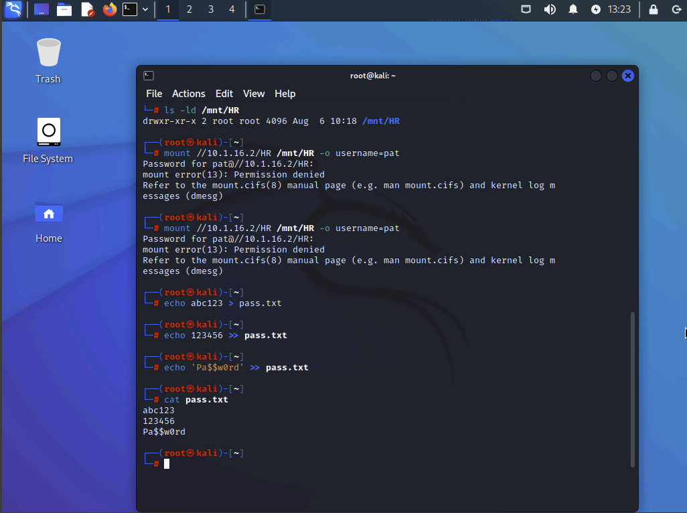
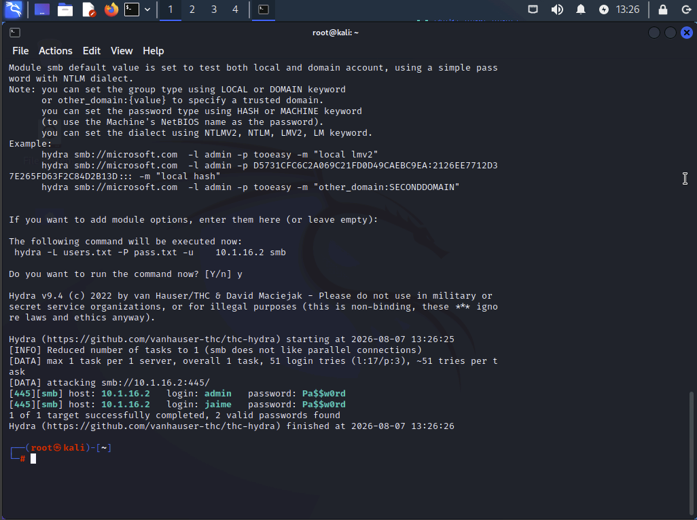
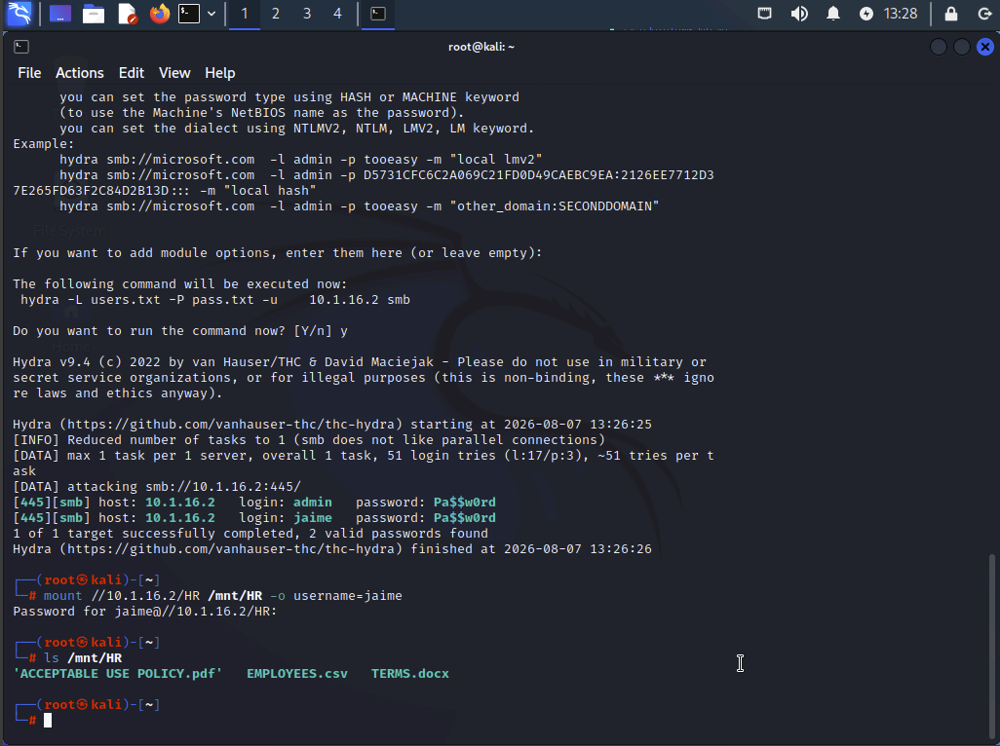
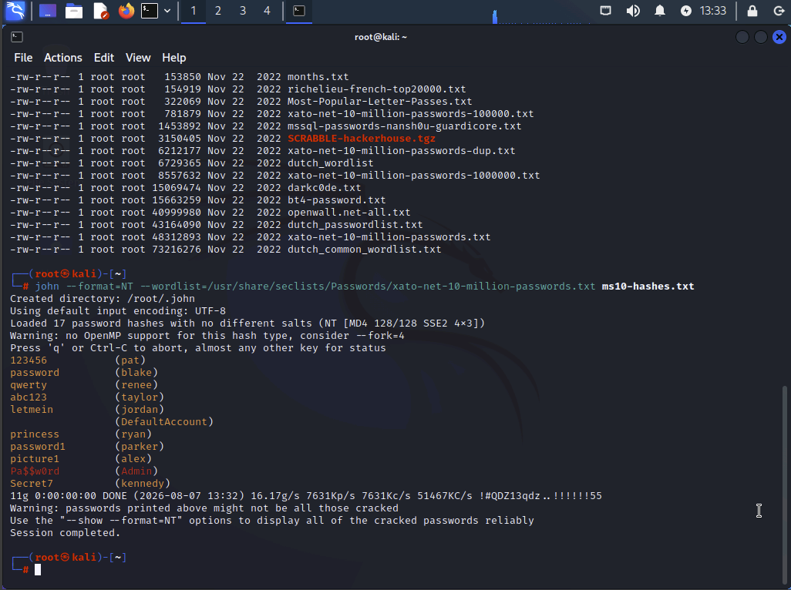
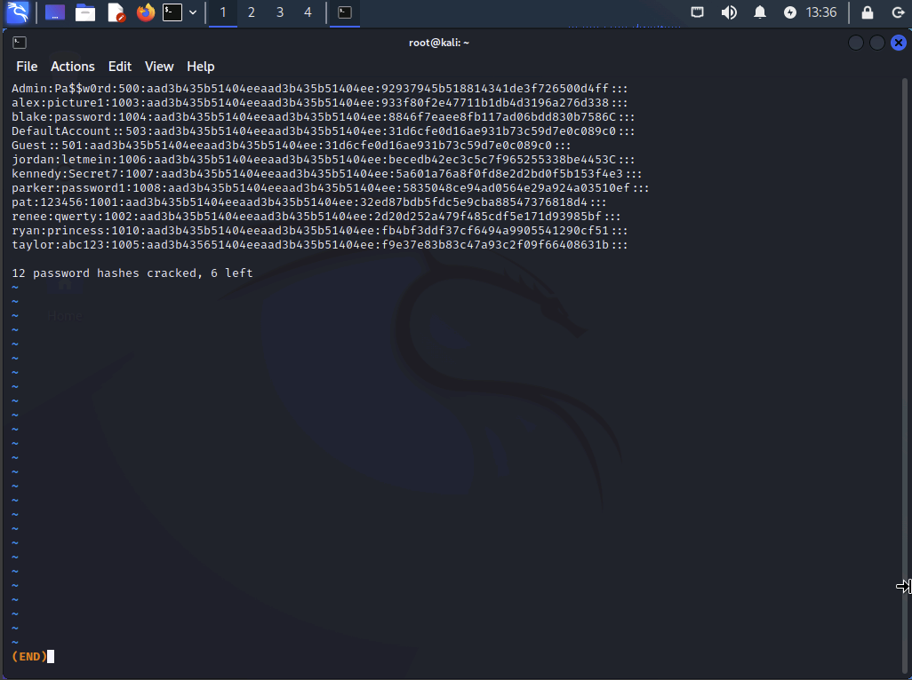
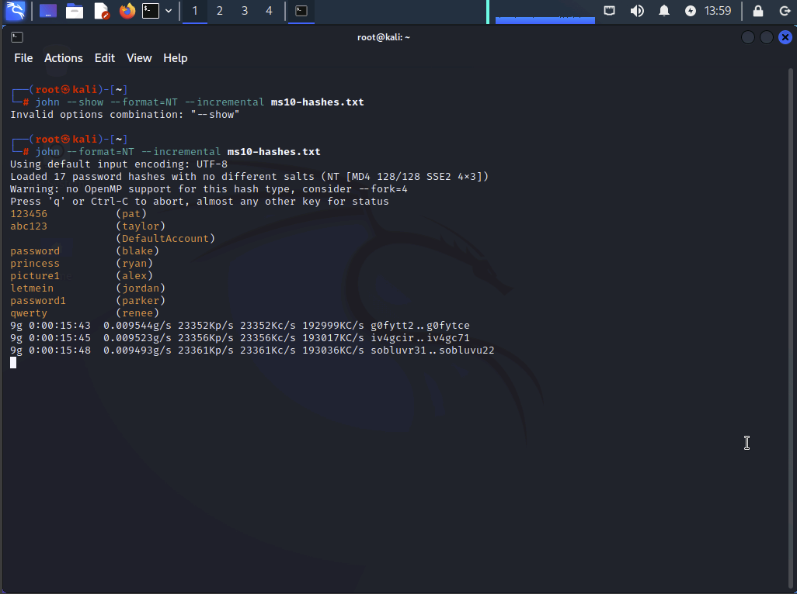
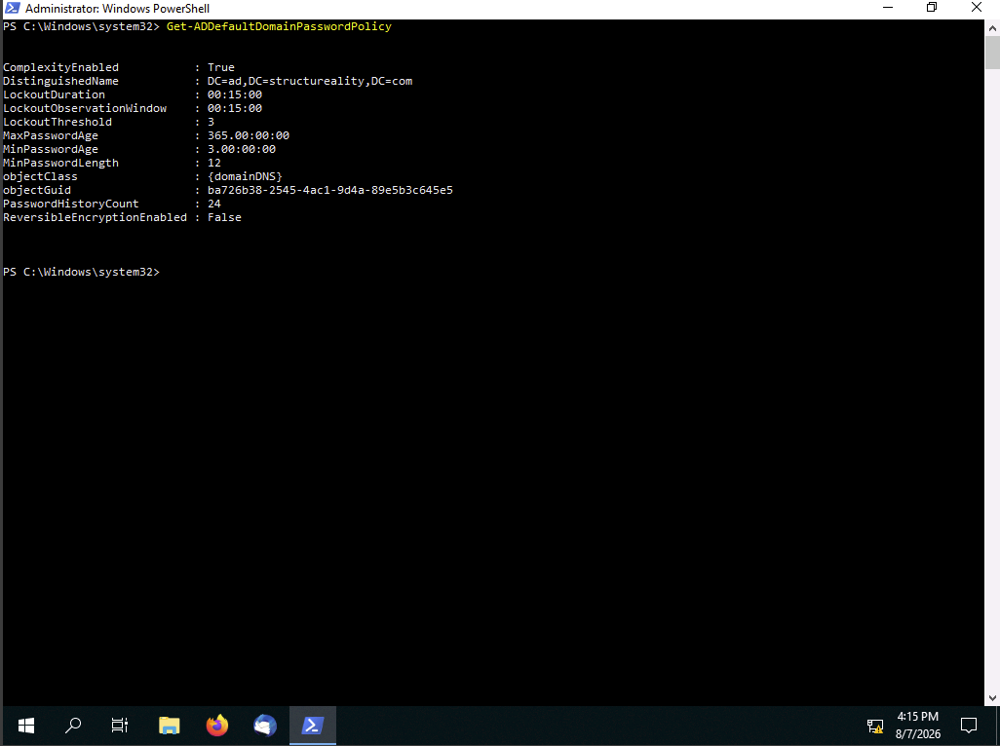

# Managing Password Security

## Lab Overview

**Lab Name:** Managing Password Security  
**Platform:** Kali Linux, MS10 Windows Server 2016, DC10 Windows Server 2019  
**Category:** Identity and Access Management (IAM) / Password Security  

## Objective

The goal of this lab was to understand common password attack techniques and implement stronger password security controls. The exercises demonstrated:

- Password spraying attacks
- Dictionary-based password cracking
- Brute-force password cracking
- Domain password policy improvements

These techniques demonstrate why organizations must implement strong password policies, account lockout controls, and secure authentication practices.

---

# Lab Tasks

## 1. Password Spraying Attack

### Overview

Password spraying attempts to authenticate using a small list of known passwords against many user accounts. Unlike traditional brute force attacks, password spraying attempts to avoid account lockout protections by limiting login attempts per account.

The lab used:

- A list of discovered usernames
- A small password list
- Hydra to automate SMB authentication attempts

---

### Screenshot 01 - Password Spray Setup

Created the mount point and reviewed the available user accounts before beginning password spraying.



---

### Screenshot 02 - Hydra Password Spray

Used Hydra to perform an automated password spraying attack against the SMB share.

The attack successfully identified valid credentials.



---

### Screenshot 03 - Share Mounted

Used discovered credentials to successfully mount the HR network share and verify access.



---

# 2. Dictionary Password Cracking

## Overview

Dictionary attacks are offline password attacks that compare password hashes against large lists of commonly used passwords.

John the Ripper was used with an NTLM password hash file and a password dictionary.

Command used:

```
john --format=NT --wordlist=/usr/share/seclists/Passwords/xato-net-10-million-passwords.txt ms10-hashes.txt
```

---

### Screenshot 04 - Dictionary Crack

Executed John the Ripper dictionary-based password cracking against the collected NTLM hashes.



---

### Screenshot 05 - Dictionary Results

Reviewed the passwords successfully recovered from the dictionary attack.



---

# 3. Brute Force Password Cracking

## Overview

A brute-force attack attempts every possible character combination until the correct password is discovered.

John the Ripper was configured for incremental brute-force cracking.

Command used:

```
john --format=NT --incremental ms10-hashes.txt
```

Longer and more complex passwords required significantly more time to crack.

---

### Screenshot 06 - Brute Force Status

Captured John the Ripper brute-force progress and status output.



---

# 4. Implementing Stronger Password Policies

## Overview

After analyzing weaknesses through password attacks, the domain password policy was strengthened.

The following security improvements were implemented:

- Increased minimum password length
- Increased password age requirements
- Enabled account lockout protections
- Reduced password attack opportunities

Updated settings included:

| Policy Setting | New Value |
|---|---|
| Lockout Observation Window | 15 minutes |
| Lockout Duration | 15 minutes |
| Lockout Threshold | 3 attempts |
| Maximum Password Age | 365 days |
| Minimum Password Age | 3 days |
| Minimum Password Length | 12 characters |

---

### Screenshot 07 - Password Policy After

Verified the updated Active Directory password policy settings after configuration changes.



---

# Key Security Concepts Learned

## Password Spraying

- Uses a small number of passwords against many accounts
- Attempts to bypass account lockout protections
- Mitigations:
  - Strong password policies
  - MFA
  - Account lockout monitoring
  - User awareness training

---

## Dictionary Attacks

- Uses lists of commonly used passwords
- Requires access to password hashes
- Offline attack method
- Mitigations:
  - Strong passwords
  - Password complexity
  - Password managers
  - Secure hashing algorithms

---

## Brute Force Attacks

- Attempts every possible password combination
- Password length is a major defense
- Longer passwords exponentially increase cracking time

---

## Password Policy Improvements

Strong password policies should include:

- Long minimum password length
- Account lockout controls
- Protection against reused passwords
- Multi-factor authentication
- Monitoring for suspicious login activity

---

# CompTIA Security+ Objectives Covered

- **2.4:** Analyze indicators of malicious activity
- **2.5:** Explain mitigation techniques used to secure the enterprise
- **4.6:** Implement and maintain identity and access management
- **5.1:** Summarize elements of effective security governance
- **5.6:** Implement security awareness practices

---

# Tools Used

- Kali Linux
- Hydra
- John the Ripper
- SMB
- Active Directory PowerShell Module
- Windows Server Domain Policy Management