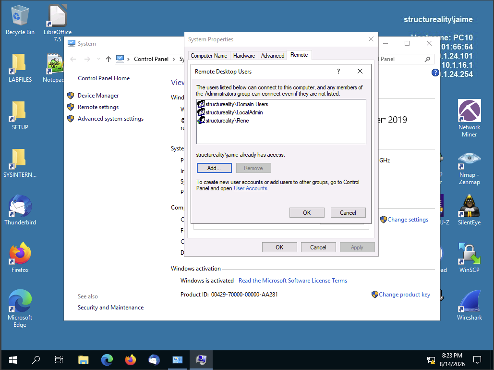
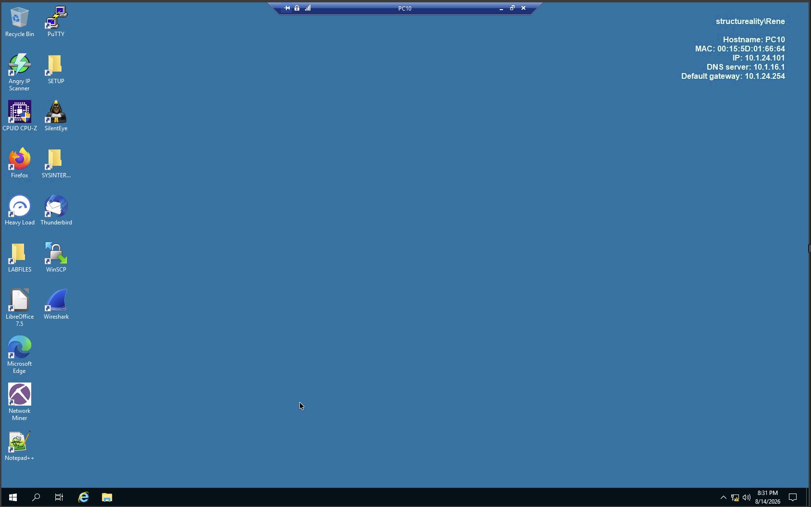
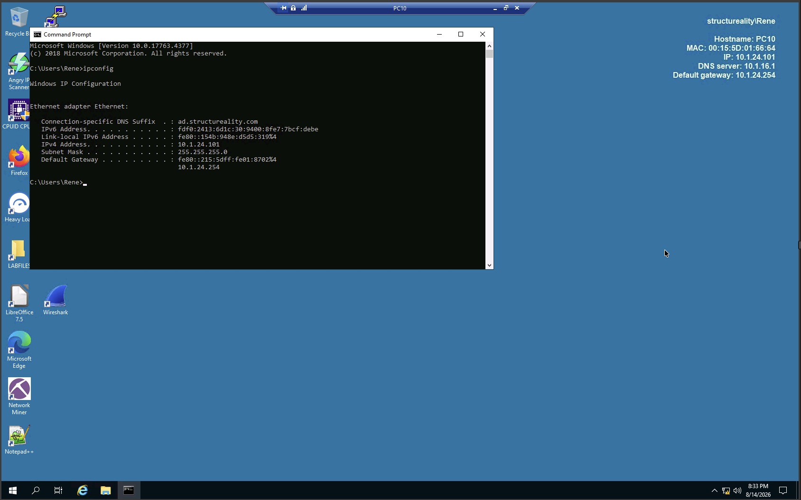
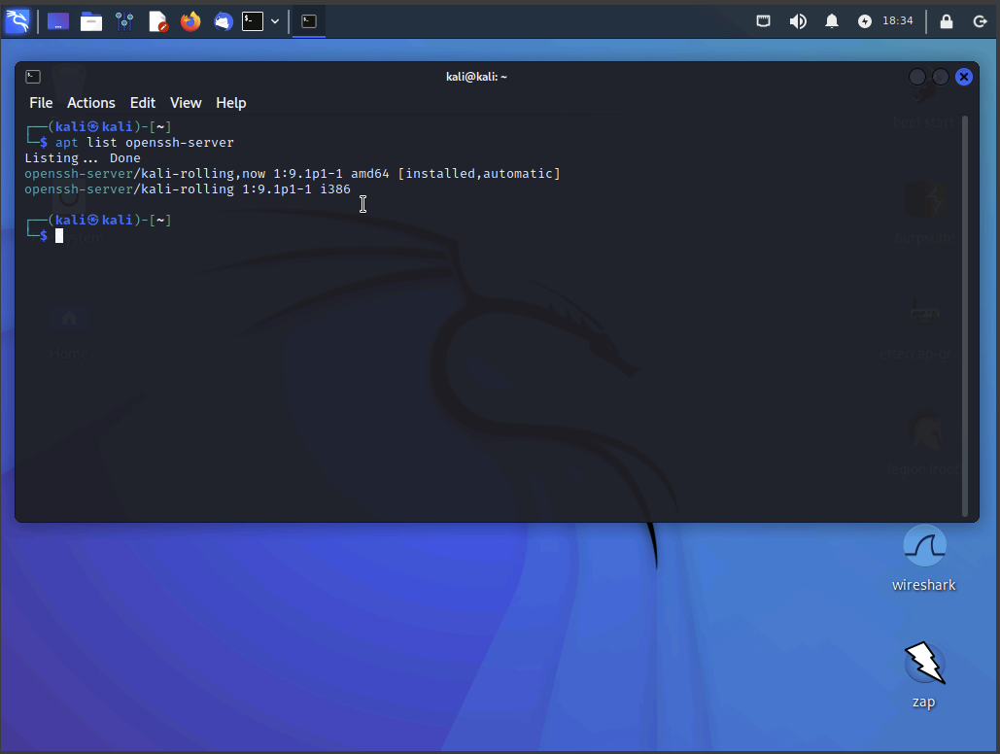
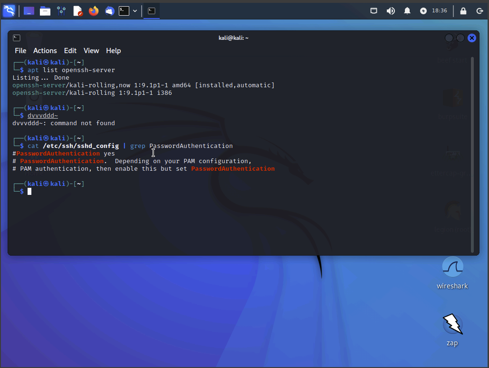
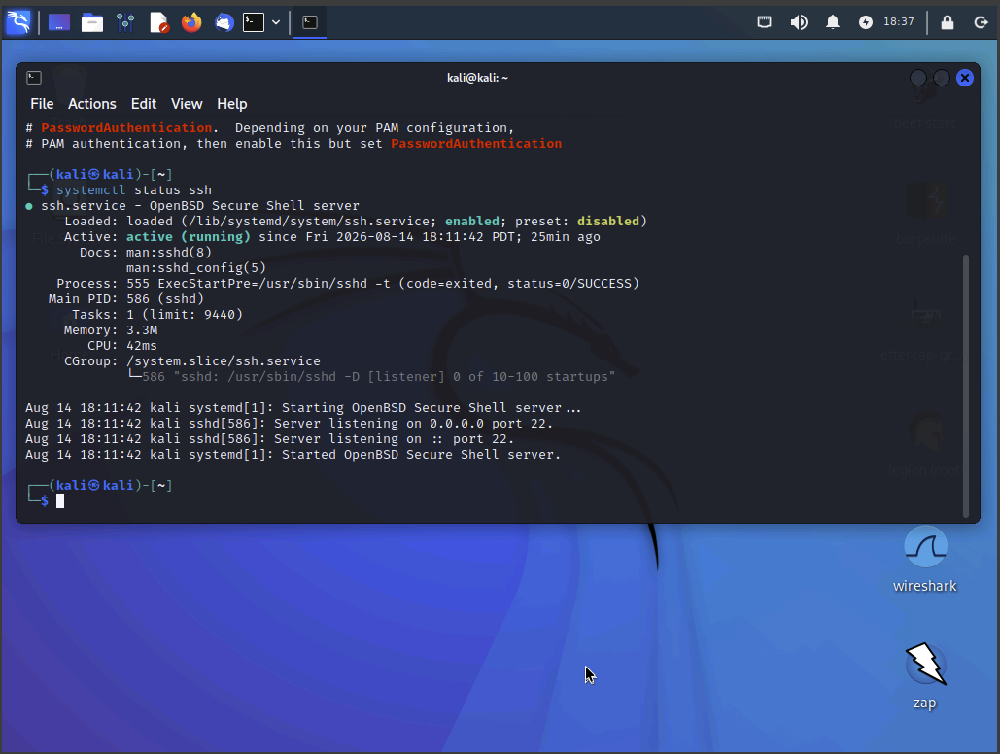
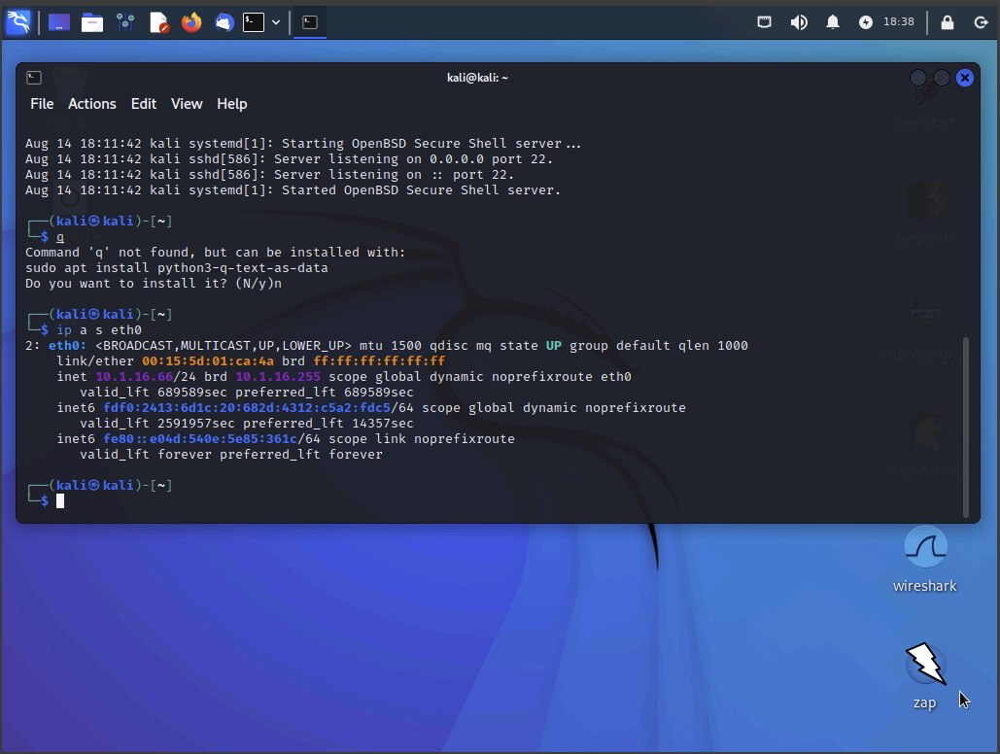
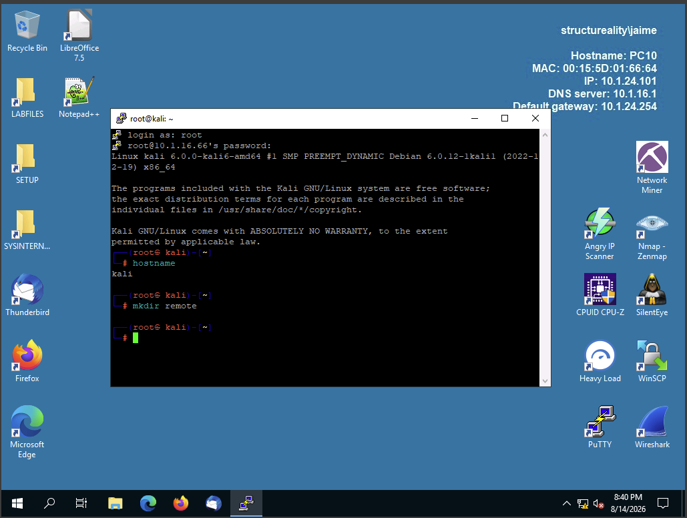
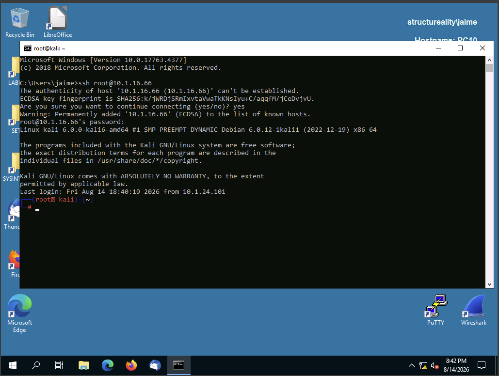
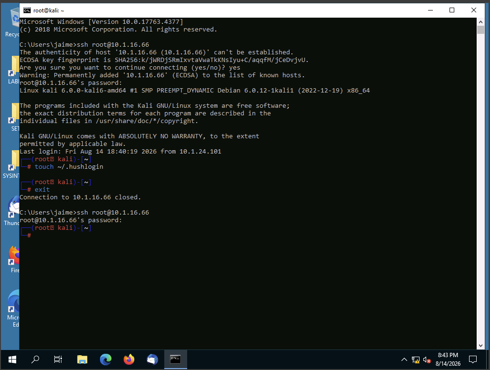

# Assisted Lab: Setting Up Remote Access

## Overview

In this lab, I configured and tested remote access technologies between Windows and Linux systems. The lab focused on Microsoft Remote Desktop (RDP), SSH configuration on Kali Linux, and establishing SSH connections from Windows to Kali using both PuTTY and the Windows command-line SSH client.

## Objectives

- Configure and use Microsoft Remote Desktop between Windows systems.
- Verify the installation and configuration of SSH on Kali Linux.
- Determine whether SSH password authentication is enabled.
- Verify that the SSH service is running.
- Establish an SSH connection using PuTTY.
- Establish an SSH connection using the Windows CLI.
- Configure SSH to suppress the automatic SSH welcome message.

---

## 1. Microsoft Remote Desktop

### Configure Remote Desktop on PC10

I configured PC10 to allow Remote Desktop connections and added the Rene account to the Remote Desktop Users group.

### Connect to PC10 from DC10

From DC10, I opened Remote Desktop Connection and connected to PC10 using the Rene account.

### Verify PC10 Network Configuration

After connecting to PC10 through Remote Desktop, I opened Command Prompt and used `ipconfig` to view the system's network configuration.

---

## 2. Verify SSH Configuration on Kali Linux

### Verify OpenSSH Installation

I used the following command to verify that the OpenSSH server was already installed:

`apt list openssh-server`

The output showed `[installed, automatic]`, confirming that OpenSSH was installed.

### Verify SSH Password Authentication

I checked the SSH configuration file using:

`cat /etc/ssh/sshd_config | grep PasswordAuthentication`

The output showed the commented `PasswordAuthentication yes` configuration. This indicates that password authentication is accepted by default when no other authentication method overrides it.

### Verify the SSH Service

I used:

`systemctl status ssh`

The output confirmed that the SSH service was active and running and that the server was listening on port 22.

### Determine Kali's IP Address

I used:

`ip a s eth0`

to determine the IPv4 address assigned to Kali's `eth0` interface.

---

## 3. Establish an SSH Connection Using PuTTY

### Connect to Kali Using PuTTY

From PC10, I opened PuTTY and configured an SSH connection to Kali using:

- **Host:** `10.1.16.66`
- **Port:** `22`
- **Protocol:** SSH

I accepted the PuTTY security alert and authenticated using the `root` account.

After connecting, I used:

`hostname`

The output confirmed that the remote system was Kali.

I then created the required `remote` directory:

`mkdir remote`

---

## 4. Establish an SSH Connection Using the Windows CLI

### Connect Using Command-Line SSH

From Windows Command Prompt, I initiated an SSH connection to Kali using:

`ssh root@10.1.16.66`

I authenticated using the root account password and successfully established the SSH session.

### Suppress the SSH Welcome Message

I created the `.hushlogin` file using:

`touch ~/.hushlogin`

The `.hushlogin` file suppresses the standard SSH login/welcome message.

After exiting the SSH session and reconnecting, the standard welcome message was no longer displayed.

---

## Key Takeaways

### Remote Desktop (RDP)

- RDP allows a user to remotely interact with a Windows computer as though they were logged in locally.
- Remote Desktop must be enabled on the target system.
- Users can be granted Remote Desktop access through the Remote Desktop Users group.
- RDP is commonly used for remote Windows administration.
- RDP uses **TCP port 3389** by default.

### SSH

- SSH provides secure remote command-line access.
- SSH uses **TCP port 22** by default.
- Kali Linux includes the OpenSSH server.
- SSH supports password authentication.
- SSH can be accessed through both GUI applications and command-line tools.

### PuTTY

PuTTY can be used as:

- A terminal emulator
- A serial console
- A network file transfer application
- An SSH client
- A Telnet client

### `.hushlogin`

The `.hushlogin` file can be placed in a user's home directory to suppress the standard SSH login/welcome message.

---

## Security+ Exam Takeaways

| Concept | Key Point |
|---|---|
| **RDP** | Remote access to Windows systems |
| **RDP Port** | TCP **3389** |
| **SSH** | Secure remote command-line access |
| **SSH Port** | TCP **22** |
| **PuTTY** | Terminal emulator, SSH client, serial console, and network file transfer tool |
| **SSH Authentication** | Password authentication is supported by default |
| **`.hushlogin`** | Suppresses the SSH login/welcome message |
| **Remote Desktop Users** | Group used to grant users Remote Desktop access |

---

## Conclusion

This lab demonstrated how to establish and manage remote access between Windows and Linux systems. I configured Microsoft Remote Desktop on PC10, connected to PC10 from DC10, verified the SSH configuration and service on Kali Linux, and established SSH sessions from Windows to Kali using both PuTTY and the Windows command-line SSH client.