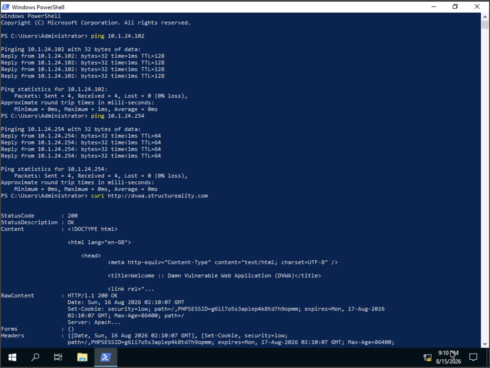
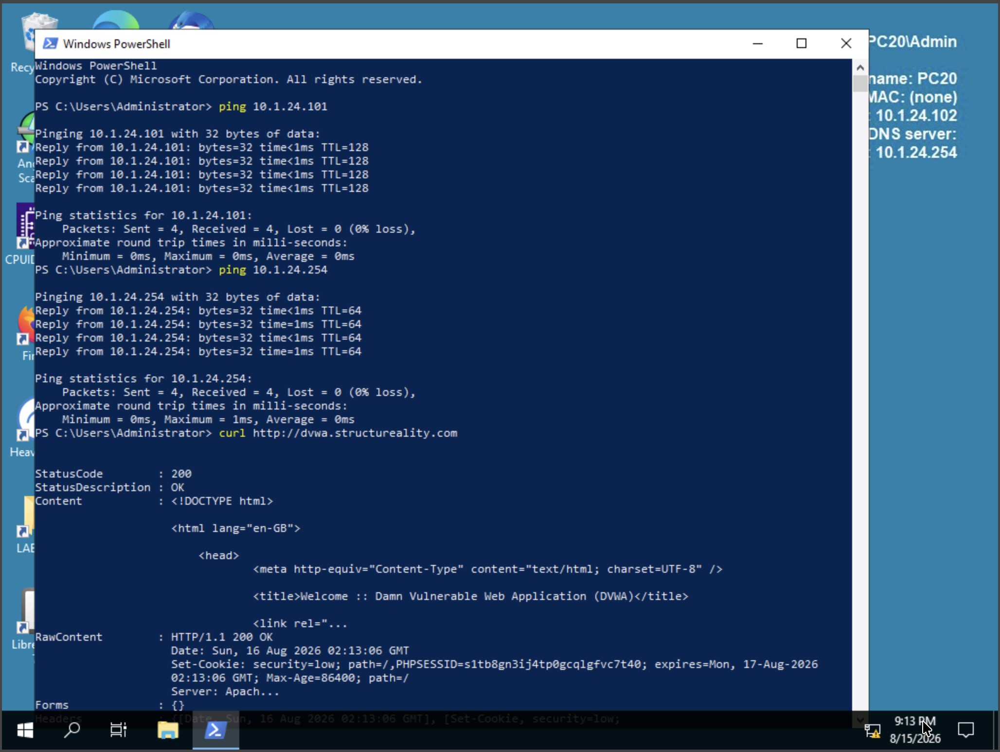
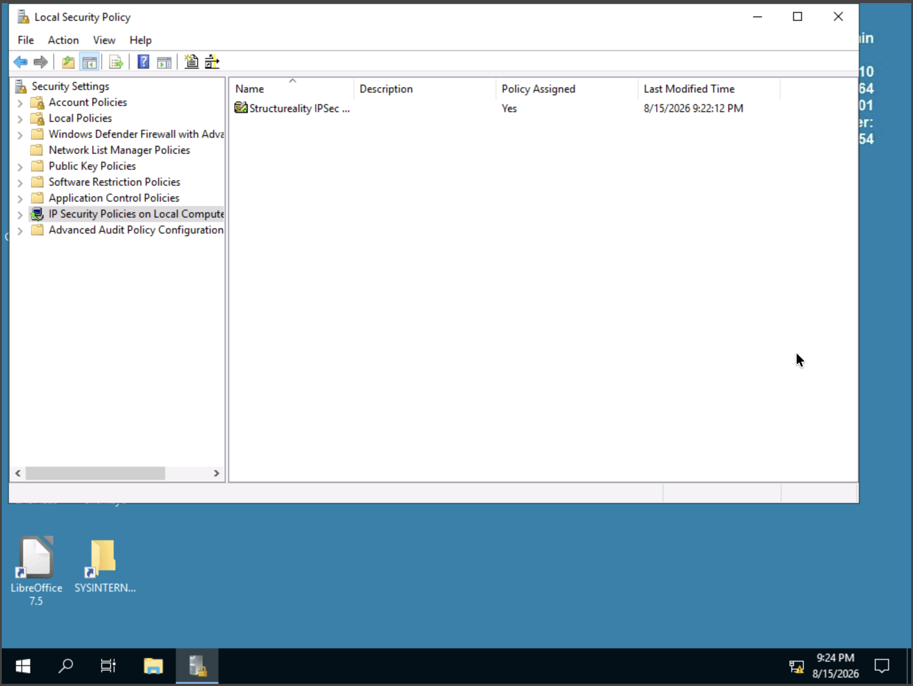
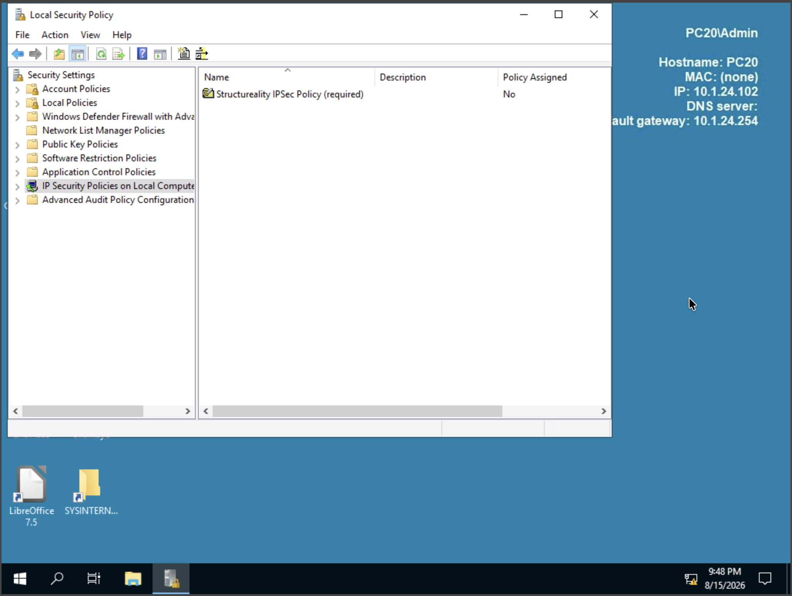
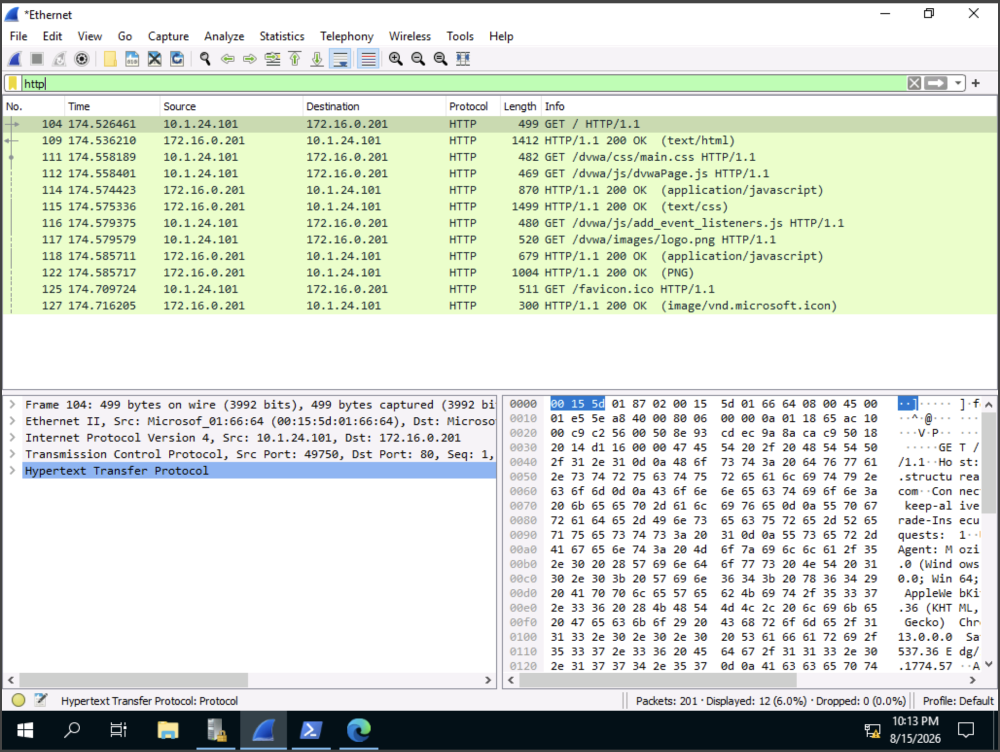
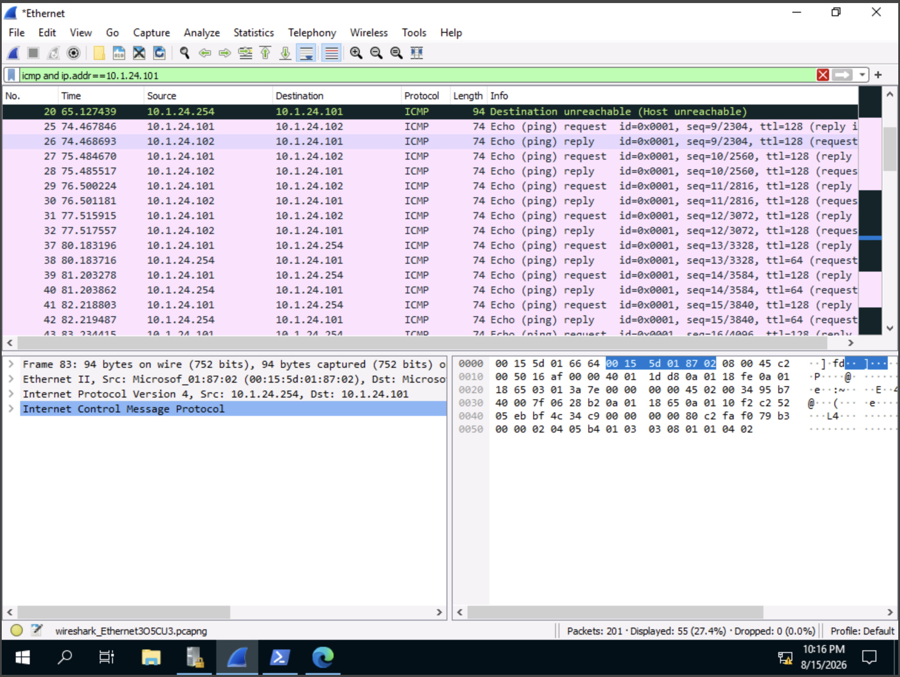
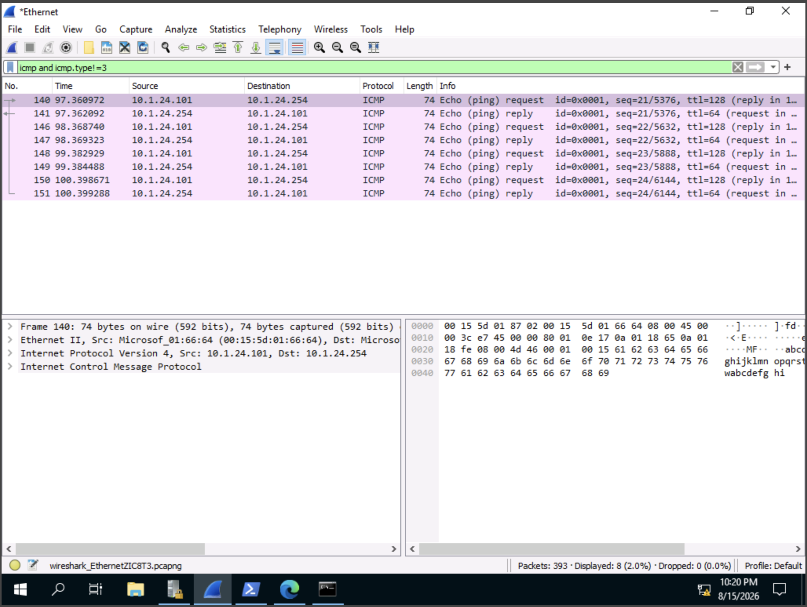
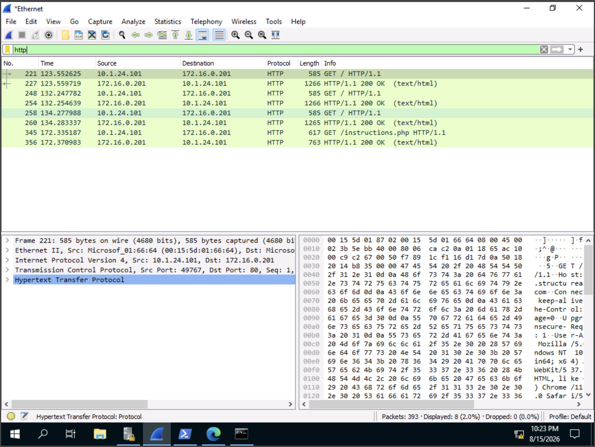
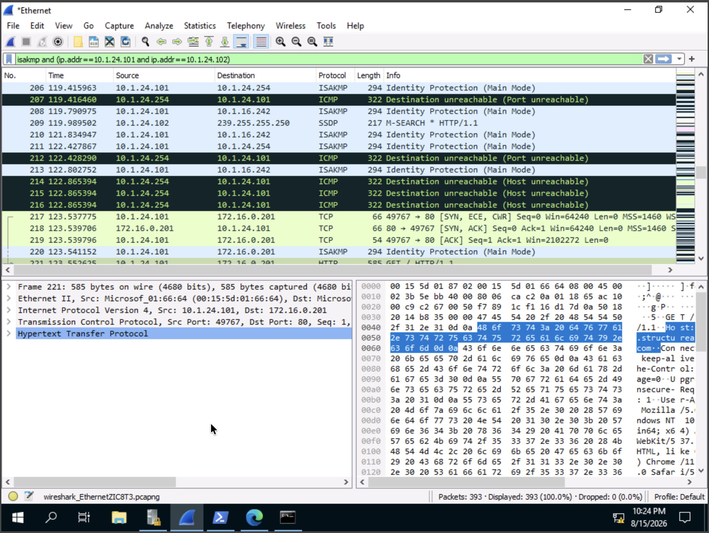
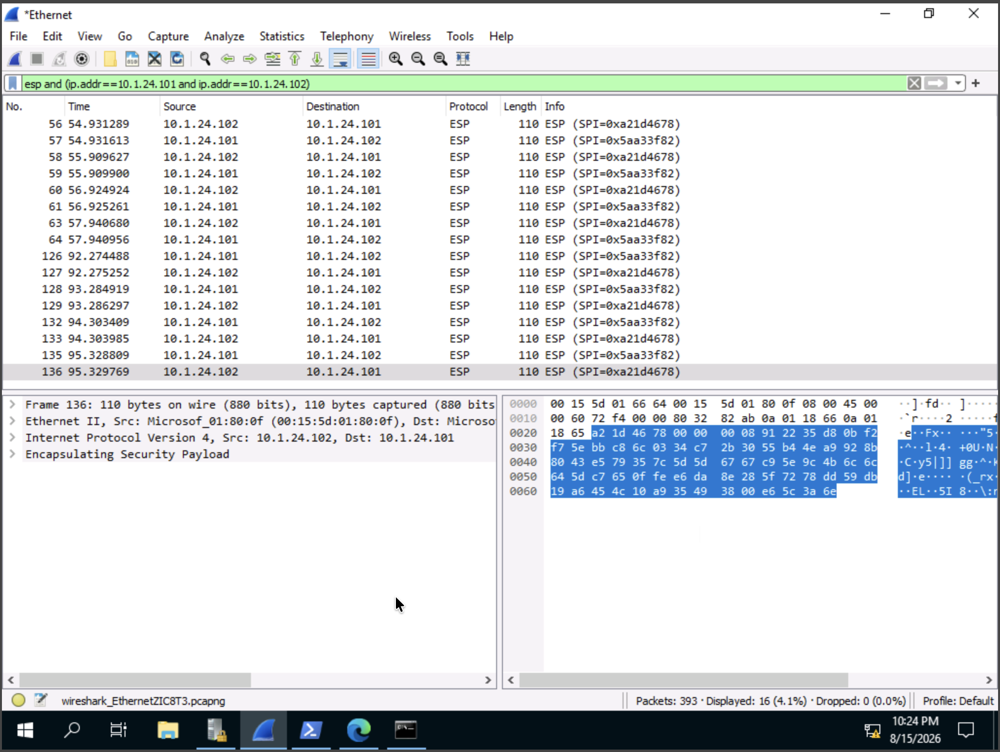

# Using IPSec Tunneling

## Overview

This lab demonstrated how to configure and verify an **IPSec VPN tunnel** between two Windows Server 2019 systems. The lab compared an IPSec policy that allows fallback to unsecured communication with a policy that requires IPSec encryption.

## Objectives

- Configure a host to attempt to negotiate an IPSec VPN.
- Configure a host to require an IPSec VPN.
- Verify that IPSec encrypts communications using Wireshark.
- Compare network traffic before and after IPSec policies are assigned.

## Lab Environment

- **PC10-v2023-06** — Windows Server 2019 — `10.1.24.101`
- **PC20** — Windows Server 2019 — `10.1.24.102`
- **Default Gateway** — `10.1.24.254`
- **Web Server** — `dvwa.structureality.com`

---

## 1. Verify Network Connectivity

Before configuring IPSec, connectivity between the systems and the default gateway was verified. The DVWA web service was also tested.

### PC10 Baseline

PC10 successfully communicated with PC20, the default gateway, and the DVWA web service.

### PC20 Baseline

PC20 successfully communicated with PC10, the default gateway, and the DVWA web service.

---

## 2. Configure an IPSec Policy That Allows Fallback

On PC10, an IPSec policy named **Structureality IPSec Policy (attempt)** was created.

The policy was configured to:

- Negotiate IPSec security.
- Use integrity and encryption.
- Use a pre-shared key for authentication.
- Allow unsecured communication if an IPSec connection could not be established.

This configuration attempts to protect communications with IPSec but allows fallback to plaintext.

The policy was assigned temporarily for validation and then un-assigned so that the lab could compare traffic before and after IPSec was enabled.

---

## 3. Configure an IPSec Policy That Requires Encryption

On PC20, an IPSec policy named **Structureality IPSec Policy (required)** was created.

The policy was configured to:

- Negotiate IPSec security.
- Use integrity and encryption.
- Use a pre-shared key for authentication.
- **Not allow unsecured communication** if IPSec negotiation fails.

This configuration requires IPSec protection rather than falling back to plaintext.

The policy was also assigned temporarily for validation and then un-assigned before the initial Wireshark capture.

---

## 4. Capture Traffic Before IPSec

Wireshark was used on PC10 to capture network traffic before the IPSec policies were active.

### HTTP Traffic

The following Wireshark display filter was applied:

    http

The HTTP request and response were visible in the packet capture, demonstrating that the web traffic was not encrypted by IPSec.

### ICMP Traffic

The following display filter was used:

    icmp and ip.addr==10.1.24.101

ICMP traffic between PC10 and PC20 was visible in the capture, demonstrating that the communications were not yet protected by the IPSec tunnel.

---

## 5. Assign the IPSec Policies

The IPSec policies were then enabled:

- PC10 used **Structureality IPSec Policy (attempt)**.
- PC20 used **Structureality IPSec Policy (required)**.

PC10 attempted to negotiate IPSec while PC20 required IPSec and would not allow fallback to plaintext.

The systems were then tested with ping traffic and the DVWA website was reloaded while Wireshark captured the resulting traffic.

---

## 6. Verify Encrypted ICMP Traffic

The following Wireshark display filter was applied:

    icmp and icmp.type!=3

The ICMP traffic between PC10 and PC20 was no longer directly visible in Wireshark, even though the ping commands were successful.

This demonstrated that the traffic was being protected by the IPSec tunnel. Gateway traffic remained visible because it was not part of the PC10-to-PC20 IPSec communication.

---

## 7. Verify HTTP Traffic

The following display filter was applied:

    http

The HTTP traffic remained visible in plaintext.

This demonstrates that the IPSec tunnel was protecting communications between PC10 and PC20, not automatically encrypting unrelated HTTP traffic to the external web service.

---

## 8. Verify IPSec Negotiation with ISAKMP

The following display filter was used:

    isakmp and (ip.addr==10.1.24.101 and ip.addr==10.1.24.102)

ISAKMP packets were observed between PC10 and PC20.

ISAKMP is used during the negotiation and establishment of security associations for IPSec.

---

## 9. Verify IPSec Encryption with ESP

The following display filter was used:

    esp and (ip.addr==10.1.24.101 and ip.addr==10.1.24.102)

ESP packets were observed between PC10 and PC20.

**Encapsulating Security Payload (ESP)** provides confidentiality and integrity for IPSec-protected traffic. The presence of ESP packets confirmed that an IPSec tunnel had been established and encrypted communications were taking place.

---

## Key Takeaways

- **IPSec** provides encrypted communication at the network layer.
- IPSec policies can **permit, block, or negotiate** security.
- A negotiate policy can be configured to allow fallback to unsecured communication or require encryption.
- **ISAKMP** is involved in IPSec security negotiation.
- **ESP** carries IPSec-protected encrypted traffic.
- Wireshark can show that encrypted traffic is present without being able to inspect the protected contents.
- IPSec tunneling protects the traffic included in the tunnel; it does not automatically encrypt unrelated traffic.

---

## Comprehensive Questions

### 1. What are the three main types of IPSec policies that can be configured?

- **Block**
- **Permit**
- **Negotiate**

### 2. What is the primary benefit of tunneling?

**Encryption**

### 3. Why was PC10 unable to collect packets from PC20 directed to the default gateway or website?

**The packets from PC20 were not sent to the PC10 interface.**

### 4. Which options can implement encrypted tunnels for secure communications?

- **SSH**
- **TLS**
- **IPsec**

### 5. What is the best IPSec policy during the initial implementation phase of a three-month rollout?

**Allow fallback to unsecured communications if a secure connection cannot be established.**

This allows systems that have not yet received the IPSec configuration to continue communicating while the policy is gradually deployed.