# Using Containers

## Overview

This lab demonstrated the fundamentals of containerization using Docker and PowerShell on Windows Server 2019. The lab covered Docker image management, container creation and execution, container networking, and user and group administration within a container.

## Objectives

- Verify Docker installation and host configuration.
- Manage Docker images and containers using PowerShell.
- Create and interact with Windows containers.
- Examine container networking and system information.
- View and manage users and groups within a container.
- Apply basic security practices to container accounts.

## Lab Environment

- **Virtual Machine:** MS10
- **Operating System:** Windows Server 2019
- **Container Image:** `mcr.microsoft.com/windows/nanoserver:1809`
- **Container Names:** `MyFirstContainer`, `TestContainer`

---

## 1. Verify Docker Installation

The Docker Engine service was checked through the Windows Services console. The service was present and running, confirming that Docker was installed and operational on the host.

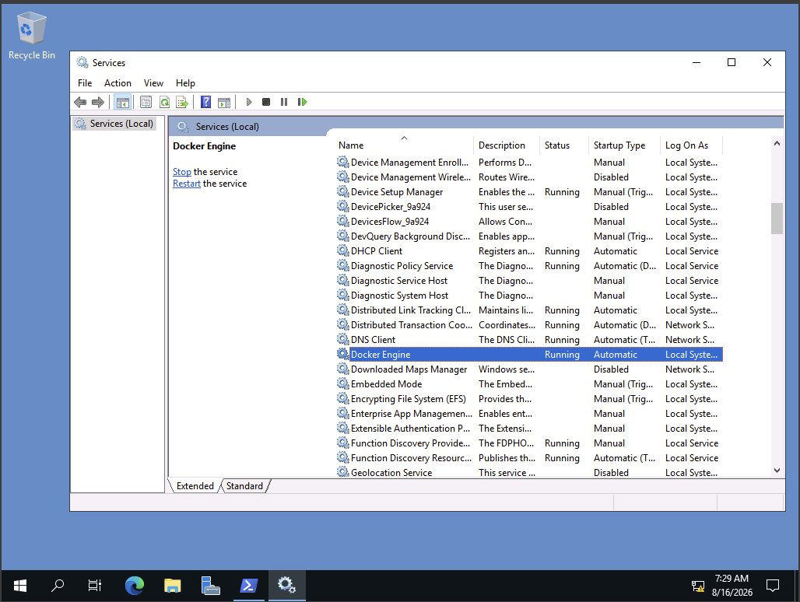

---

## 2. Verify the Host System

PowerShell was used to verify the host's network configuration and hostname.

The following commands were used:

    ipconfig
    hostname

The host was confirmed to be running Windows Server 2019.

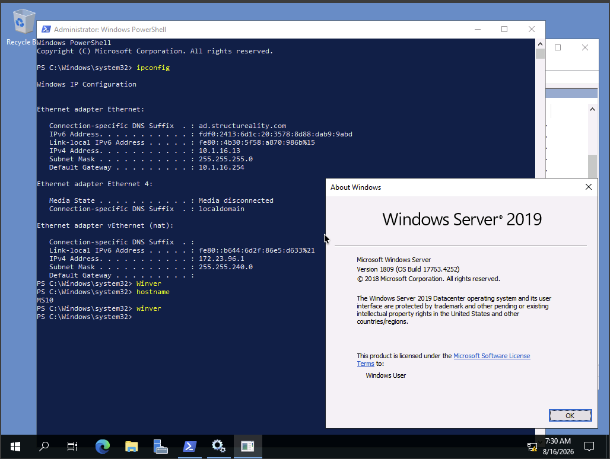

---

## 3. View Available Docker Images

The following command was used to list the Docker images available on the system:

    docker images

The pre-downloaded `mcr.microsoft.com/windows/nanoserver:1809` image was available for use.

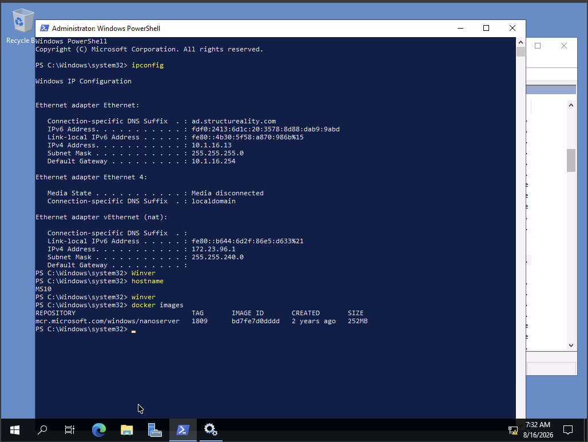

---

## 4. Create and Manage a Container

A container named `MyFirstContainer` was created from the Nano Server image:

    docker create --name MyFirstContainer mcr.microsoft.com/windows/nanoserver:1809

The container was then started and its status was checked using:

    docker start MyFirstContainer
    docker ps -a

Because the container did not have an active process or interactive session, it exited after starting.

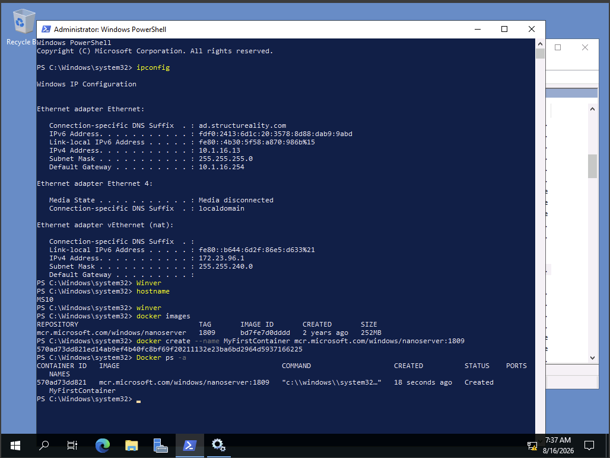

---

## 5. Create and Interact with a Container

An interactive container named `TestContainer` was created using:

    docker run -it --name TestContainer mcr.microsoft.com/windows/nanoserver:1809

Commands were then run from inside the container to examine its system information and networking configuration:

    ver
    ipconfig
    hostname
    netstat -aon

The container has its own operating system environment, hostname, network configuration, and listening ports.

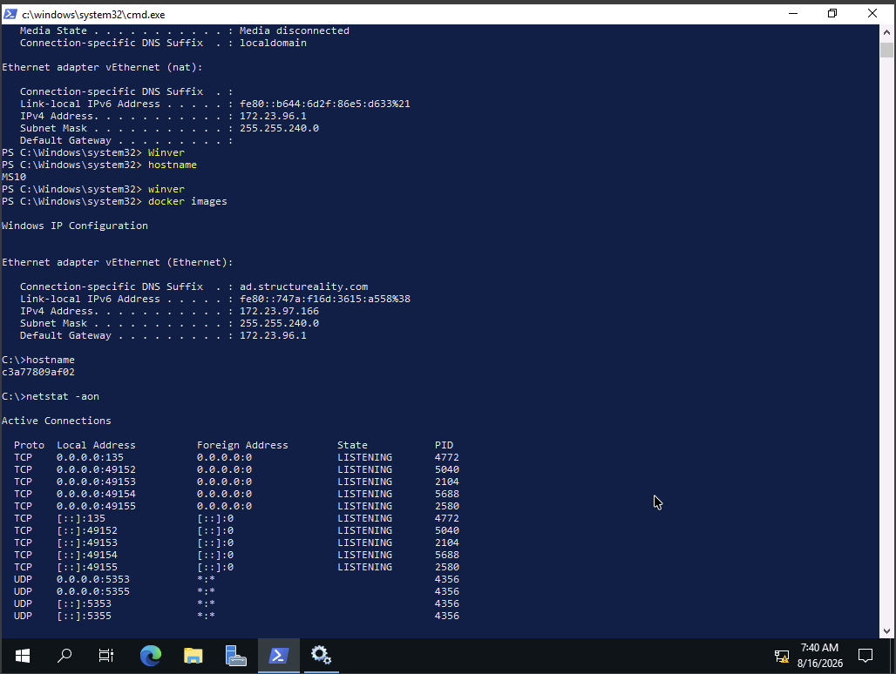

---

## 6. Test Container Networking

The container's network connectivity was tested by pinging the default gateway and the host virtual machine.

    ping <DefaultG>
    ping <MSip>

Both tests were successful, demonstrating that the container could communicate with the NAT network and the host.

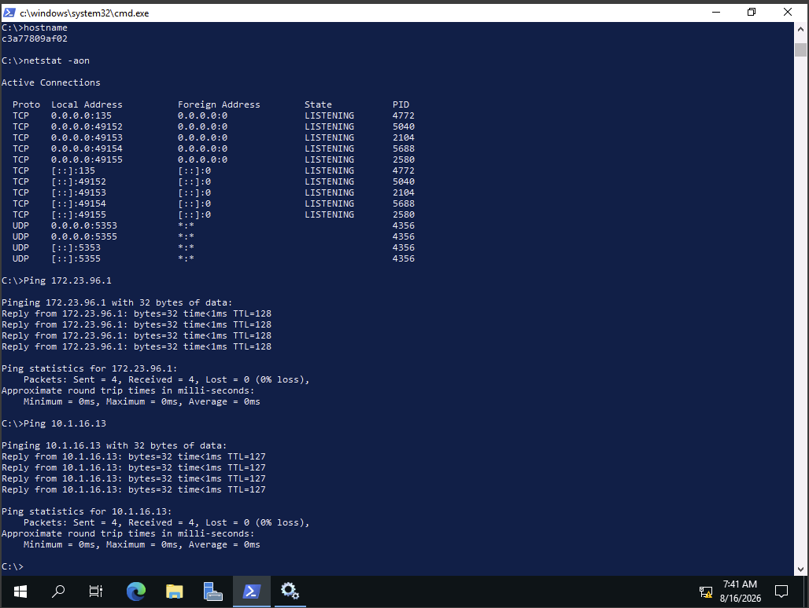

The container session was then exited with:

    exit

---

## 7. Start and Verify the Container

The `TestContainer` container was started again:

    docker start TestContainer

The status of all containers was then checked:

    docker ps -a

`TestContainer` was shown as running.

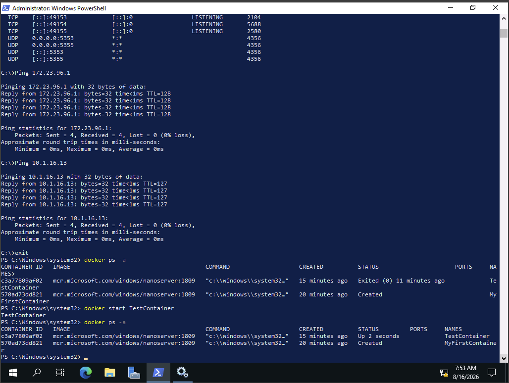

---

## 8. View Container Users

A command session was opened inside `TestContainer`:

    docker exec -it TestContainer cmd

The current username and local users were examined using:

    echo %username%
    net user
    net user Administrator

This demonstrated that containers have their own local user accounts and security settings.

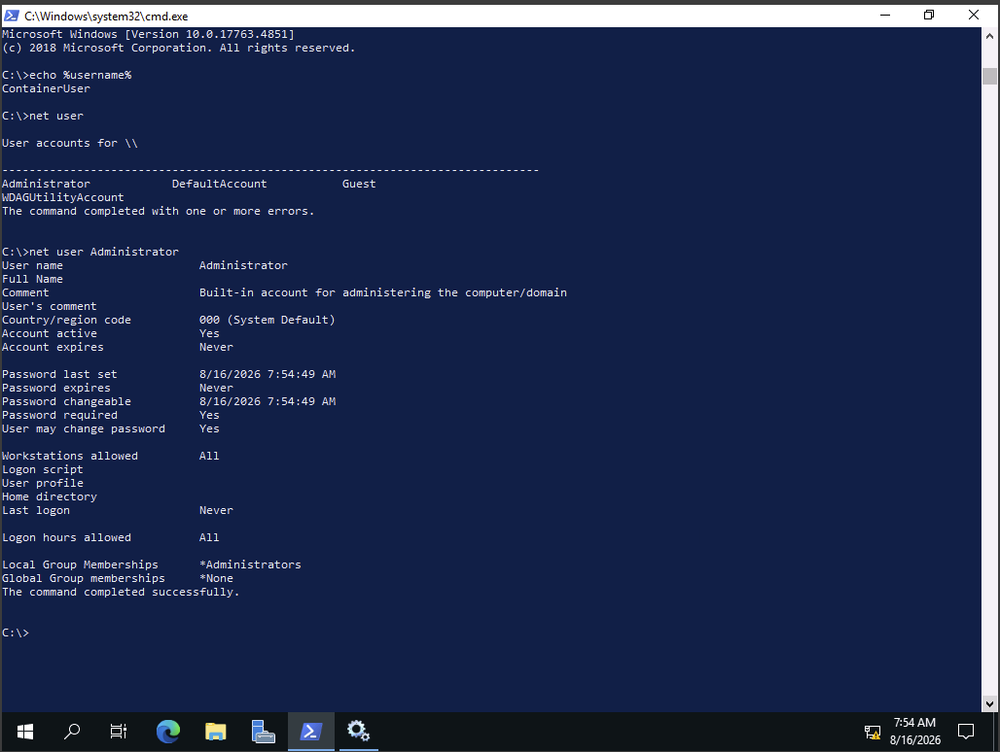

---

## 9. View Container Groups

The container's local groups were listed using:

    net localgroup

This was used to identify the groups available within the container and determine whether a Docker Administrators group was present.

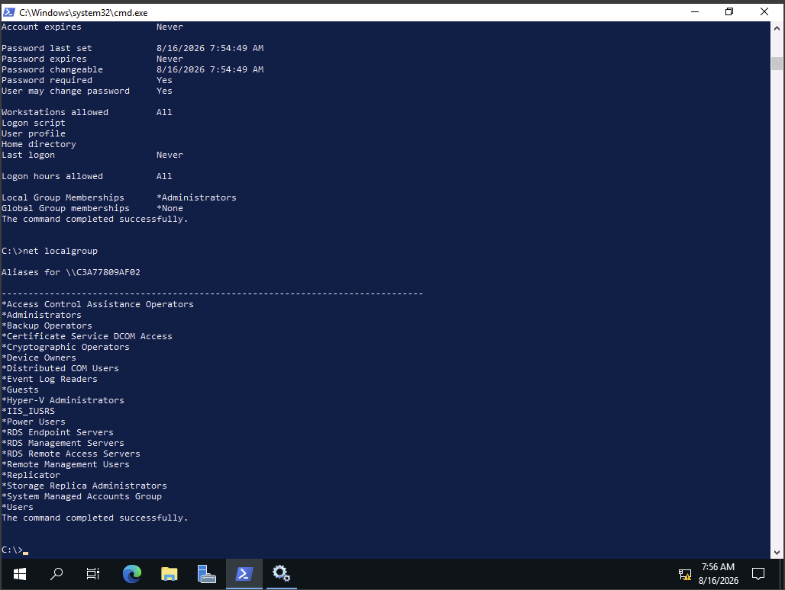

---

## 10. Access the Container as ContainerAdministrator

The container was accessed using the `ContainerAdministrator` account:

    docker exec -it --user ContainerAdministrator TestContainer cmd

The username was verified with:

    echo %username%

The session confirmed that the container can be accessed using its built-in container administrator account.

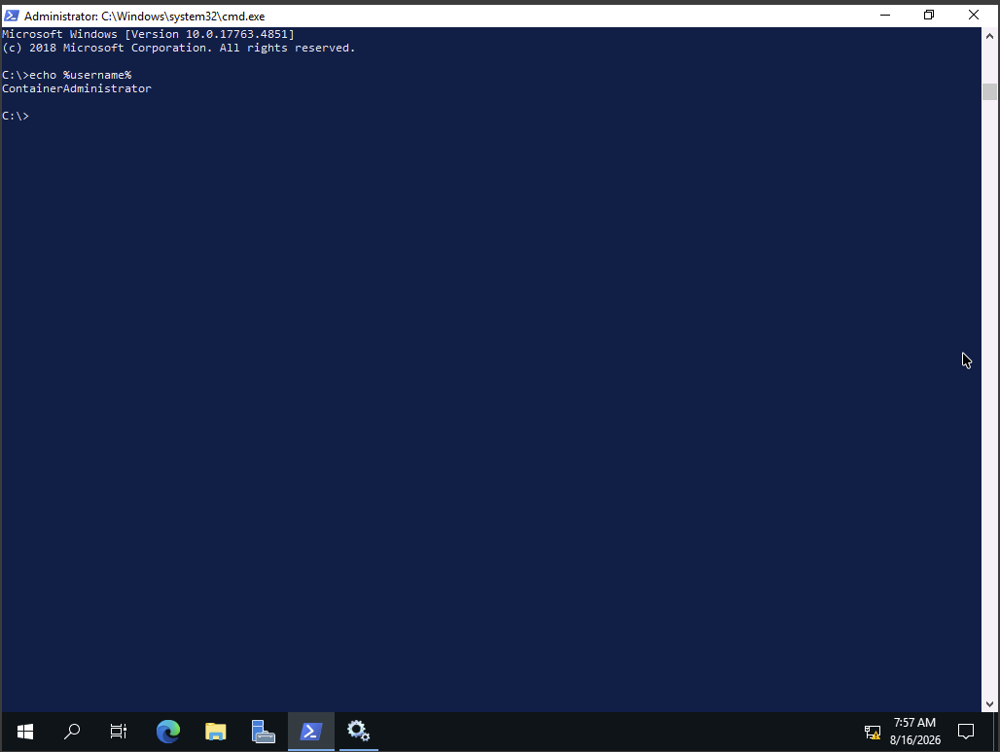

---

## 11. Create and Configure a Container User

A new local user named `testuser` was created:

    net user testuser pa$$word123 /ADD

The user's account information was then viewed:

    net user testuser

The user was added to the Power Users group:

    net localgroup "Power Users" testuser /add

The account was checked again to verify the updated group membership.

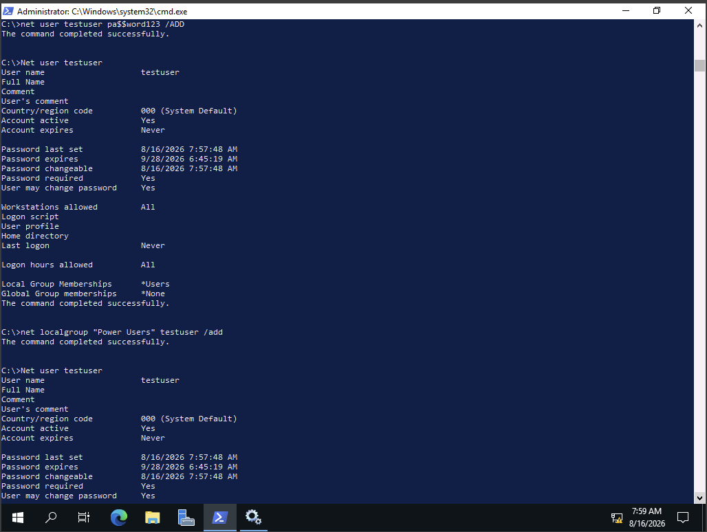

---

## 12. Configure the Administrator Account

The Administrator account password was changed using:

    net user Administrator pa$$word123 /passwordchg:yes

This demonstrates the importance of configuring strong account credentials before deploying a container into a production environment.

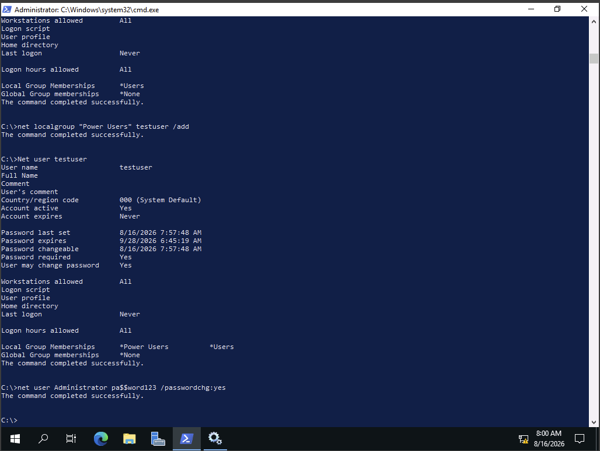

---

## Security Takeaways

- Containers provide isolated environments for applications and services.
- Containers have their own users, groups, networking, and security settings.
- Docker images can be reused to quickly create containers.
- `docker ps -a` can be used to monitor the state of containers.
- `docker exec` allows administrators to interact with a running container.
- Containers should be isolated from production networks while security checks are being performed.
- Container accounts should use strong passwords and appropriate privileges.
- Administrative privileges inside a container should be limited to what is necessary.
- Containerization provides isolation, but containers still require proper security configuration before deployment.

## Comprehensive Questions

### 1. What command is used to stop a container session?

**`docker stop MyContainer`**

### 2. How do you build a new image based on the Dockerfile in the current directory?

**`docker build -t my-dummy-image .`**

### 3. What command lists all available Docker images?

**`docker images`**

### 4. How do you start a container session for `MyContainer`?

**`docker exec -it MyContainer powershell`**

### 5. How do you specify a local image for building a container?

**Include the tag listed by the `docker images` command.**