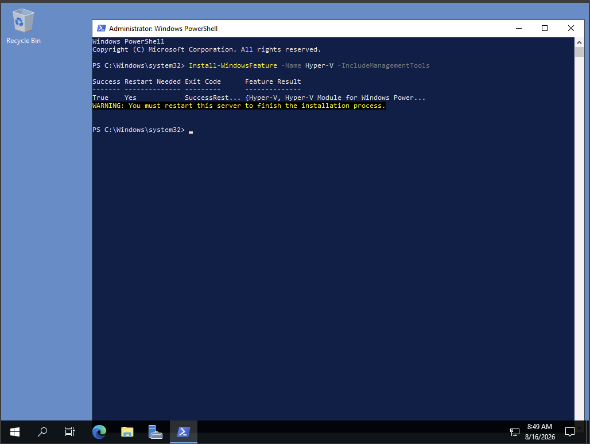
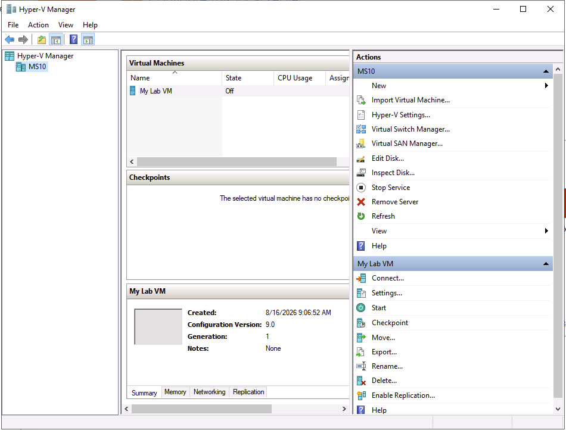
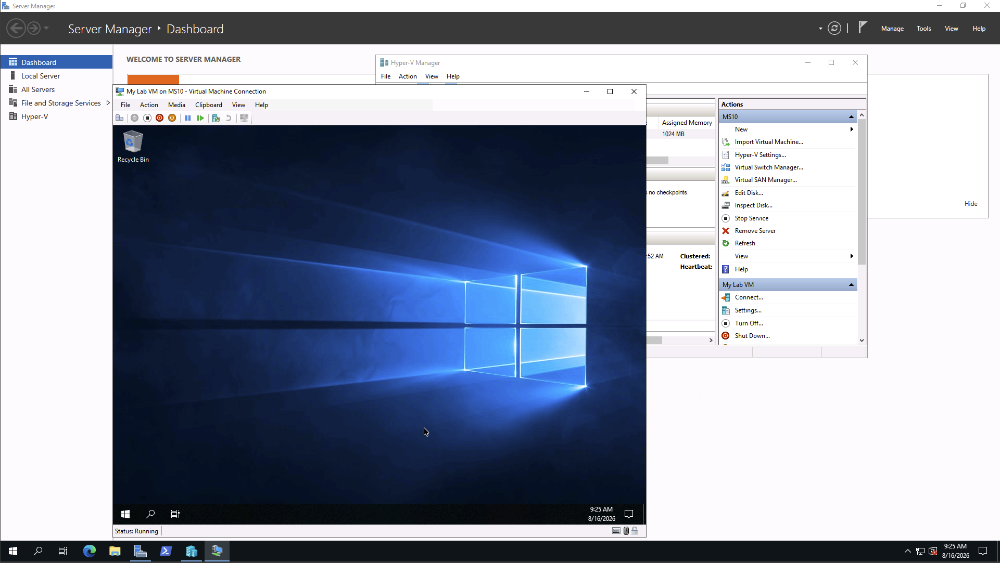
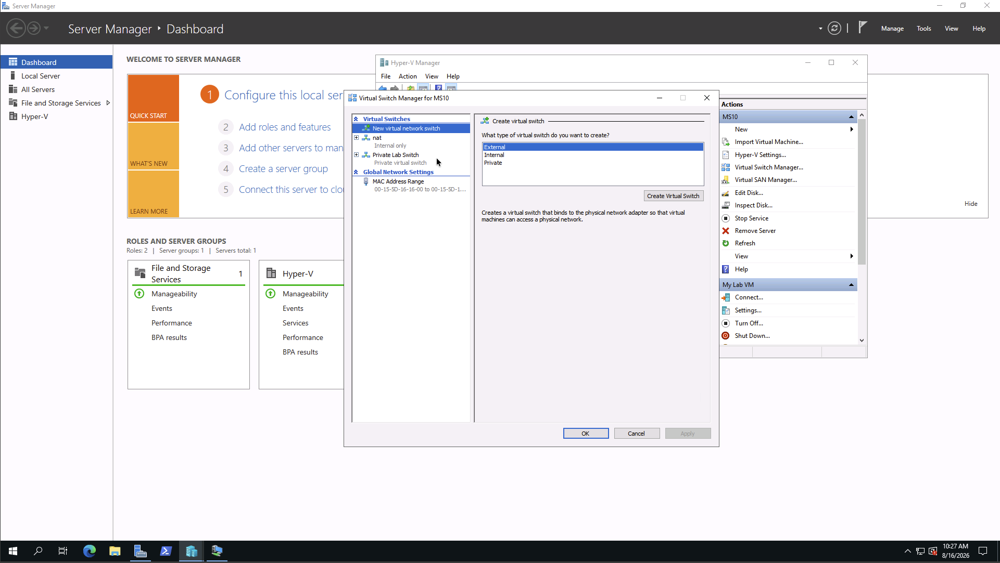
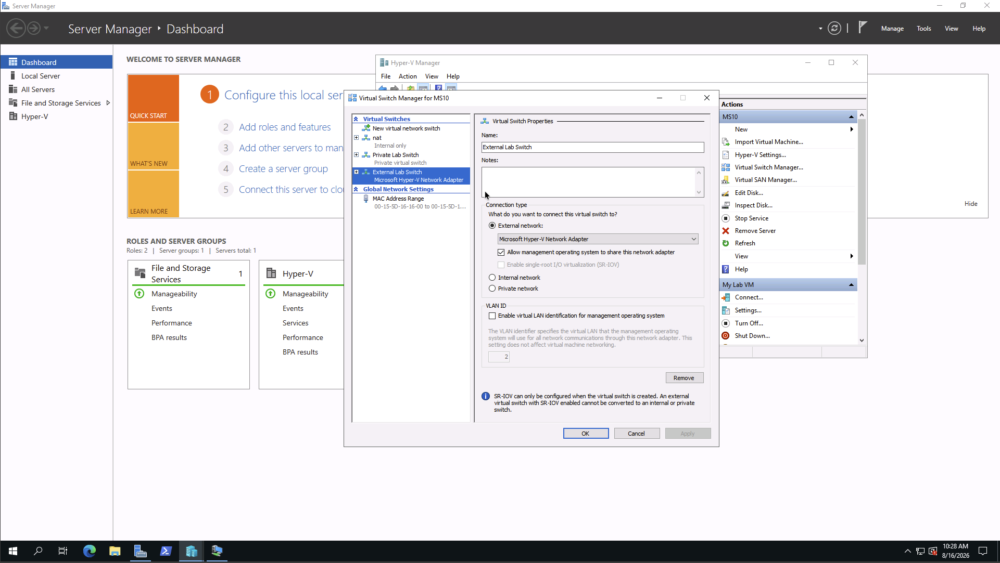
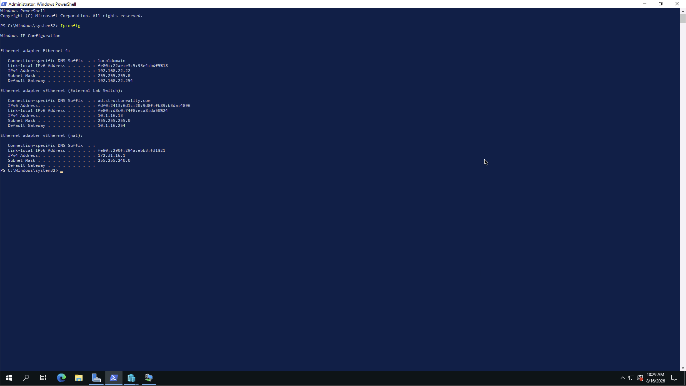
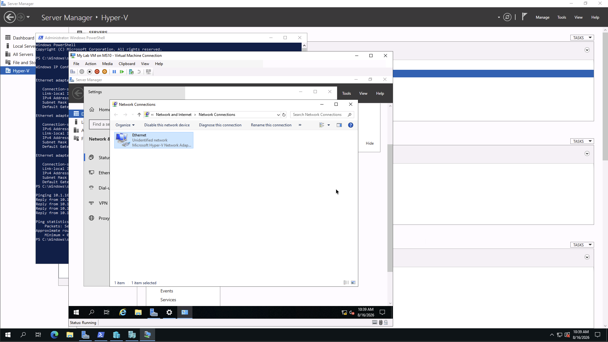
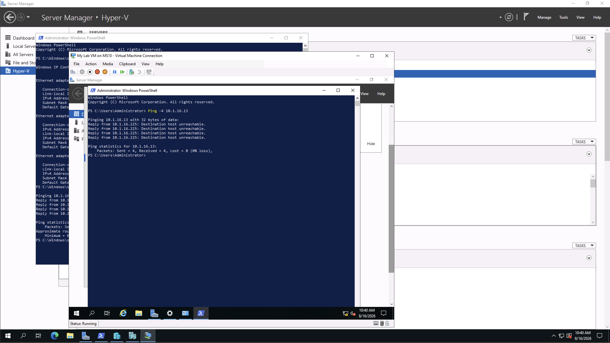
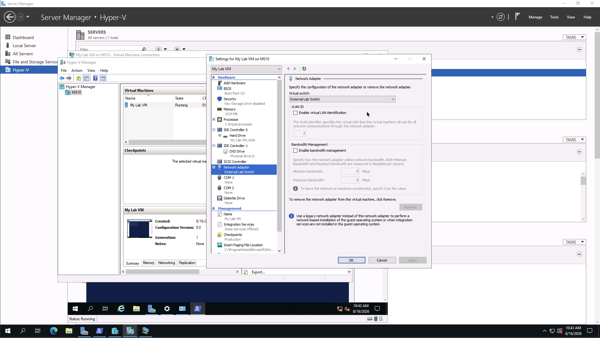
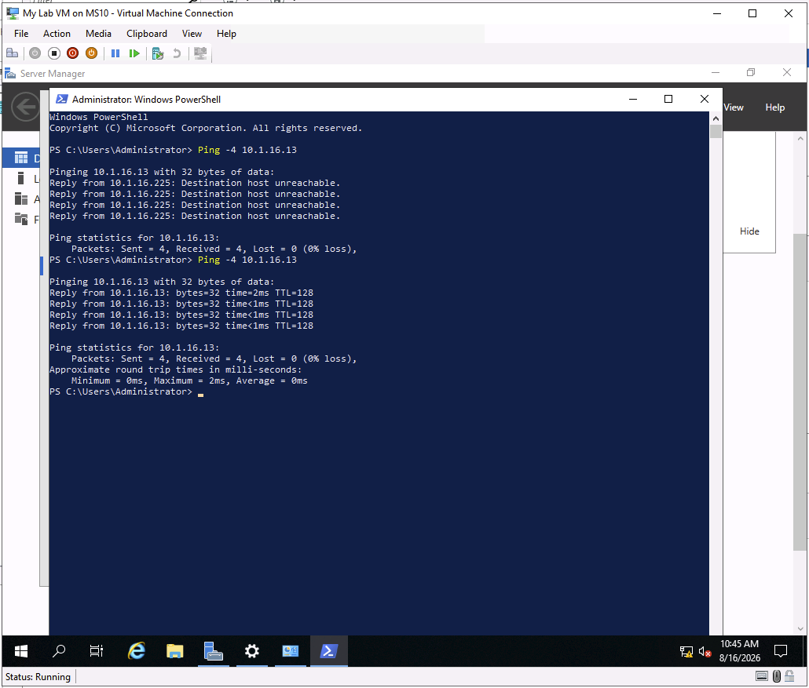

# Using Virtualization

## Overview

This lab demonstrated virtualization using **Hyper-V on Windows Server 2019**. The lab covered installing Hyper-V, creating and configuring a virtual machine, installing Windows Server 2019, creating virtual switches, and testing network isolation and connectivity.

## Objectives

- Install and verify Hyper-V on Windows Server 2019.
- Create and configure a virtual machine.
- Install Windows Server 2019 on the virtual machine.
- Create private and external virtual switches.
- Connect a virtual machine to different virtual switches.
- Compare the network isolation provided by private and external switches.

## Lab Environment

- **Hyper-V Host:** MS10
- **Host Operating System:** Windows Server 2019
- **Virtual Machine:** My Lab VM
- **My Lab VM Operating System:** Windows Server 2019
- **MS10 External Switch IP:** `10.1.16.13`
- **My Lab VM IP:** `10.1.16.225`

---

## 1. Install Hyper-V

Hyper-V was installed on the MS10 Windows Server 2019 host using PowerShell:

    Install-WindowsFeature -Name Hyper-V -IncludeManagementTools

The installation completed successfully. The server was then restarted to complete the Hyper-V installation.

---

## 2. Create a Virtual Machine

Hyper-V Manager was opened through Server Manager. A new virtual machine named **My Lab VM** was created using the New Virtual Machine Wizard.

The virtual machine was configured as a **Generation 1** virtual machine with:

- **Startup Memory:** 1024 MB
- **Virtual Hard Disk:** 90 GB
- **Installation:** Operating system installed later

---

## 3. Install Windows Server 2019

Windows Server 2019 was installed on My Lab VM using the virtual machine's DVD drive.

The installation used:

**Windows Server 2019 Standard (Desktop Experience)**

After installation, the virtual machine successfully booted into Windows Server 2019.

---

## 4. Configure a Private Virtual Switch

A **Private Lab Switch** was created using Hyper-V Virtual Switch Manager.

A private switch allows communication only between virtual machines connected to the same private switch. It does not provide access to the Hyper-V host or the external network.

---

## 5. Configure an External Virtual Switch

An **External Lab Switch** was created using Hyper-V Virtual Switch Manager.

The external switch was associated with the host's network adapter, allowing connected virtual machines to communicate with the host and other devices on the network.

---

## 6. Verify the External Virtual Switch IP

The MS10 host's network configuration was checked using:

    ipconfig

The IPv4 address for the **vEthernet (External Lab Switch)** adapter was:

    10.1.16.13

---

## 7. Connect My Lab VM to the Private Switch

My Lab VM was configured to use the **Private Lab Switch** through its Network Adapter settings.

The virtual machine was configured with the following IPv4 settings:

- **IP Address:** `10.1.16.225`
- **Subnet Mask:** `255.255.255.0`
- **Default Gateway:** `10.1.16.254`
- **Preferred DNS:** `10.1.16.1`

---

## 8. Test Private Switch Isolation

From My Lab VM, the host's IP address was pinged:

    Ping -4 10.1.16.13

The ping failed.

This was expected because a **private Hyper-V switch completely isolates connected virtual machines from the Hyper-V host and external network**. A private switch only allows communication between devices connected to that same private switch.

---

## 9. Connect My Lab VM to the External Switch

The Network Adapter settings for My Lab VM were changed from the Private Lab Switch to the **External Lab Switch**.

---

## 10. Test External Switch Connectivity

After connecting My Lab VM to the External Lab Switch, the host was pinged again:

    Ping -4 10.1.16.13

The ping was successful.

This demonstrated that an **external Hyper-V switch** allows the virtual machine to communicate with the Hyper-V host and other devices on the network.

---

## Hyper-V Virtual Switch Types

### External

An **External** switch is connected to a physical network adapter on the Hyper-V host. Virtual machines connected to it can communicate with:

- The Hyper-V host
- Other devices on the external network
- Other virtual machines connected to the switch

### Internal

An **Internal** switch allows communication between the Hyper-V host and virtual machines but does not provide direct access to the external network.

### Private

A **Private** switch provides the greatest network isolation. Virtual machines can communicate with other devices connected to the same private switch but cannot communicate with the Hyper-V host or external network.

---

## Security Takeaways

- Virtualization allows multiple isolated systems to operate on the same physical host.
- Hyper-V virtual switches control how virtual machines communicate with each other, the host, and external networks.
- **Private switches** provide strong network isolation and are useful for security testing.
- **Internal switches** allow communication between the host and virtual machines without providing external network access.
- **External switches** provide virtual machines with access to the external network.
- Virtual machines should be connected to the least-privileged network necessary for their purpose.
- Network isolation can reduce the potential impact of a compromised virtual machine.

---

## Comprehensive Questions

### 1. What PowerShell command is used to install Hyper-V on Windows Server 2019?

**`Install-WindowsFeature -Name Hyper-V -IncludeManagementTools`**

### 2. How do you create a new virtual machine in Hyper-V Manager?

**Select "New" → "Virtual Machine"**

### 3. Devices connected to an external Hyper-V switch can connect with what other devices?

- **Other devices connected to the external switch**
- **Other devices on the network**
- **The host computer**

### 4. What is a true statement about a Hyper-V private virtual switch?

**Virtual machines connected to a private switch can connect only to other devices connected to the private switch.**