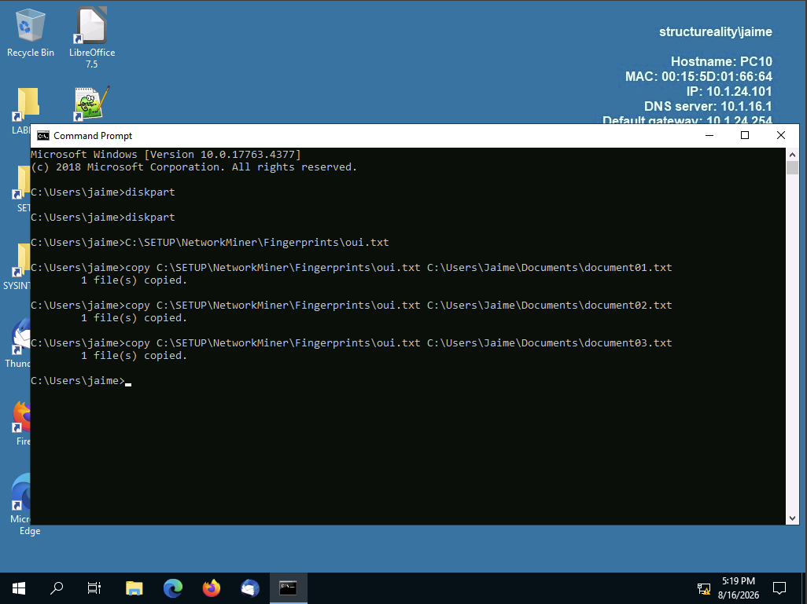
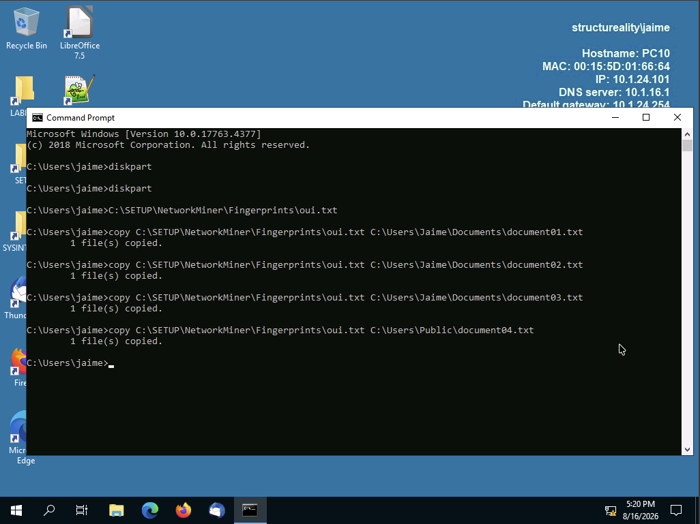
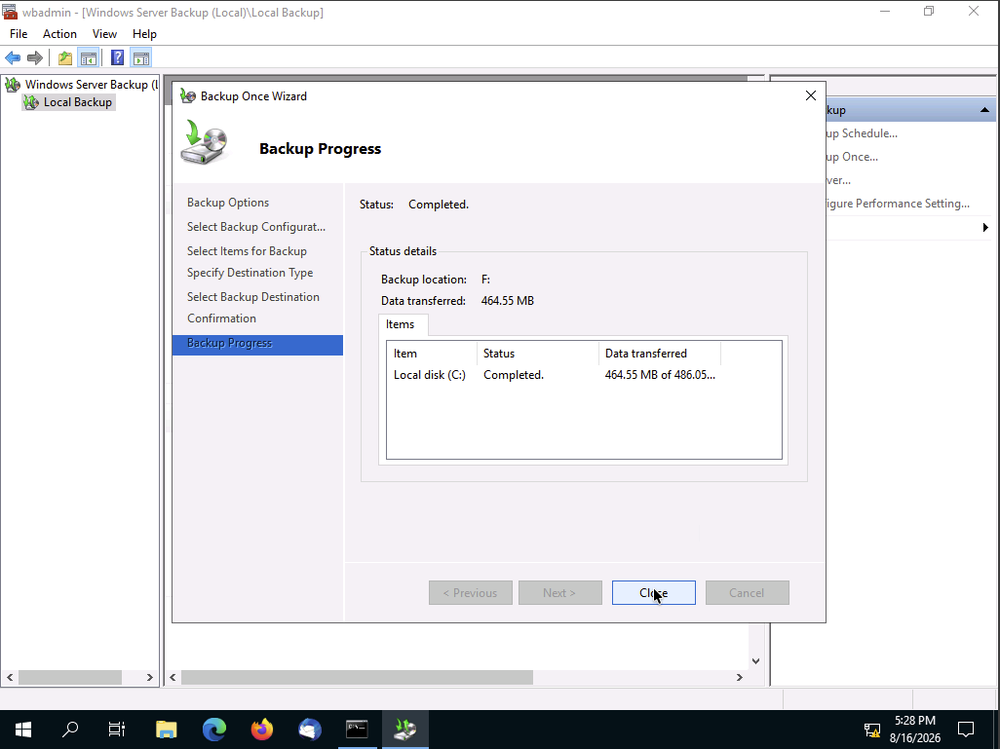
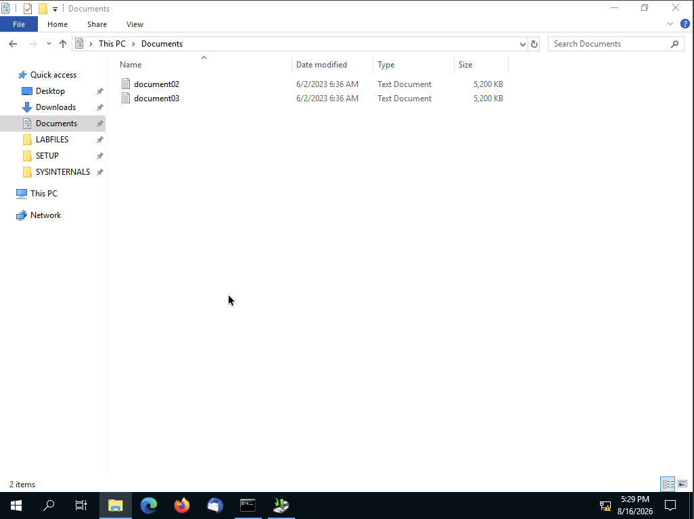
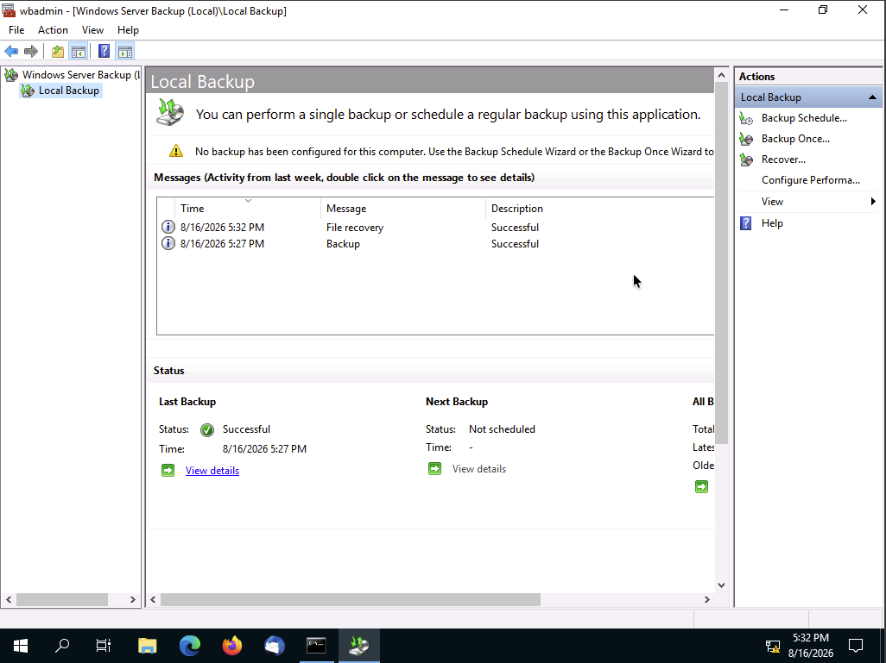
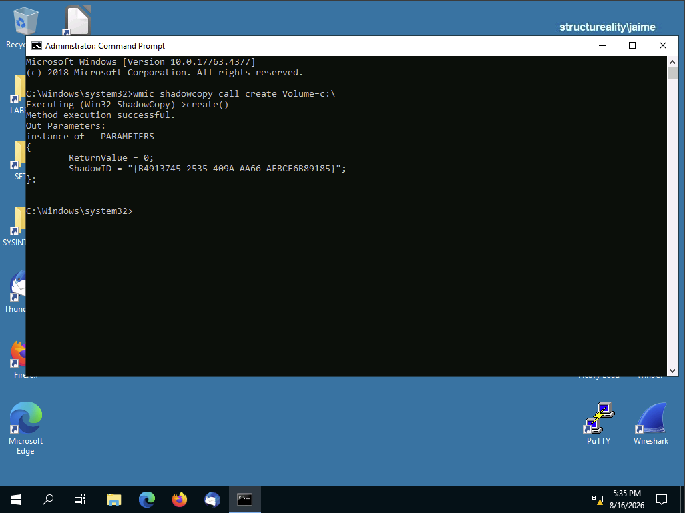
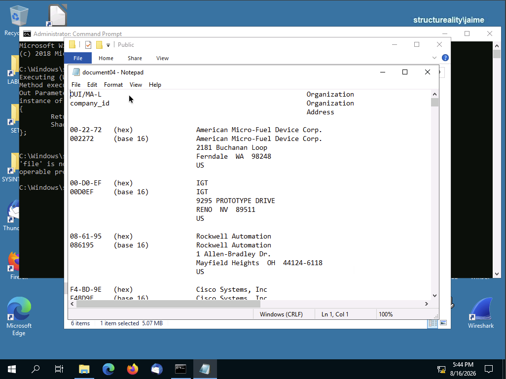
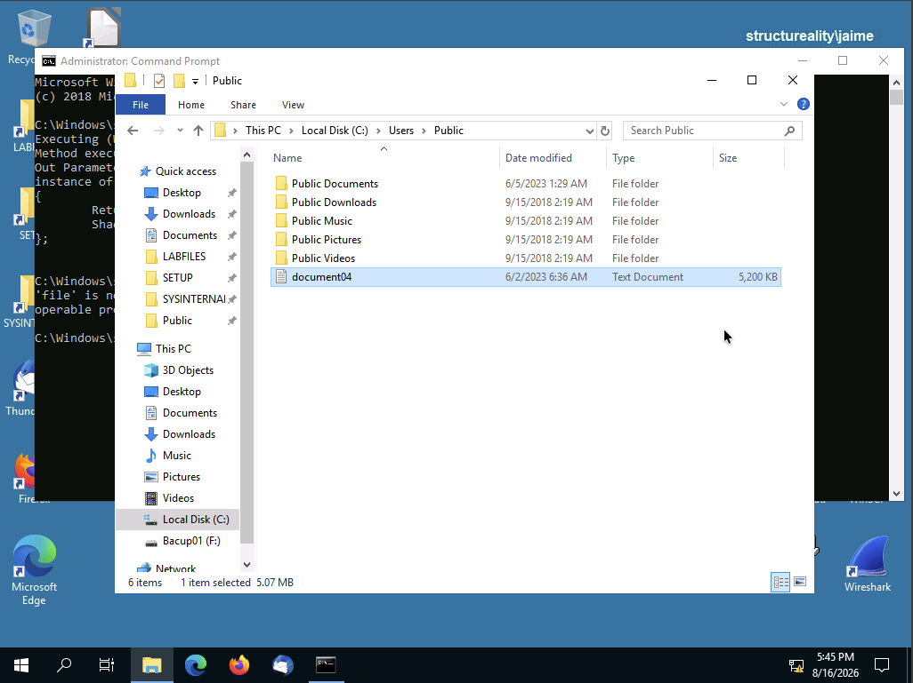

# Implement Backups

## Overview

This lab demonstrated backup and recovery techniques in Windows Server 2019. The lab covered preparing backup storage, creating a backup with Windows Server Backup, restoring a deleted file, and using Volume Shadow Copy Service (VSS) to restore a previous version of a modified file.

## Objectives

- Prepare storage for backup operations.
- Perform a backup using Windows Server Backup.
- Restore a deleted file from a backup.
- Enable and use Volume Shadow Copy Service.
- Restore a previous version of a modified file.
- Understand the differences between backups and VSS.

## Lab Environment

- **Virtual Machine:** PC10
- **Operating System:** Windows Server 2019
- **User:** Jaime
- **Backup Target:** `F:`
- **Backup Volume:** `Backup01`

---

## 1. Prepare Backup Sample Files

Several copies of `oui.txt` were created as sample files for the backup and restoration exercises.

The files `document01.txt`, `document02.txt`, and `document03.txt` were placed in:

    C:\Users\Jaime\Documents

A fourth copy, `document04.txt`, was placed in:

    C:\Users\Public

The additional storage volume was prepared as the backup destination. The volume was assigned the drive letter `F:` and named `Backup01`.

---

## 2. Perform a Windows Server Backup

Windows Server Backup was used to perform a one-time backup of:

    C:\Users

The backup was stored on the `F:` backup volume.

This created a backup that could be used to recover files that were subsequently deleted.

---

## 3. Delete a File

`document01.txt` was deleted from:

    C:\Users\Jaime\Documents

The Recycle Bin was emptied to ensure the file was fully removed from the system.

---

## 4. Restore a Deleted File from Backup

The deleted `document01.txt` file was restored using the Windows Server Backup.

The restored file was confirmed in:

    C:\Users\Jaime\Documents

This demonstrates how backups can be used to recover files after accidental deletion or data loss.

---

## 5. Enable Volume Shadow Copy Service

Volume Shadow Copy Service (VSS) was enabled on drive `C:`.

A VSS shadow copy was then forced to ensure a previous version of the file would be available for the restoration exercise.

---

## 6. Modify a File

The file:

    C:\Users\Public\document04.txt

was modified by adding `changed` as a new first line.

This created a changed version that could be compared against the previous version stored by VSS.

---

## 7. Restore a Previous Version Using VSS

The previous version of `document04.txt` was restored using Volume Shadow Copy Service.

The restored file no longer contained the added `changed` line.

---

## Backup vs. Volume Shadow Copy Service

### Backup

A backup creates a separate copy of data that can be used to restore files after deletion, corruption, or other data loss.

In this lab, Windows Server Backup was used to restore `document01.txt` after it was deleted.

### Volume Shadow Copy Service (VSS)

VSS maintains previous versions of files and can be used to restore a file to an earlier state after it has been modified.

VSS is **not a replacement for backups**. If a file is deleted from a drive, VSS cannot necessarily be used to recover it. Backups provide a separate recovery mechanism.

---

## Security and Recovery Takeaways

- Backups are an important part of resilience and recovery.
- Backup media should be separate from the original system.
- Essential backups should be stored **offsite** to protect against events affecting the primary location.
- Backup schedules should be based on how much data the organization can afford to lose.
- Deleted files can be recovered from backups.
- Modified files can be restored from backups or previous versions maintained by VSS.
- VSS provides quick access to previous versions of files but should not be treated as a complete backup solution.
- Regular backups help organizations recover from accidental deletion, system failures, and other data-loss events.

---

## Comprehensive Questions

### 1. If a file is deleted, which options can be used to restore the file?

**Answers:**

- Backup
- Volume Shadow Copy Service

### 2. If a file has been modified, which options can be used to restore the file?

**Answers:**

- Backup
- Volume Shadow Copy Service

### 3. What is a best practice for backups?

**Store essential backups offsite.**

### 4. What is the most important consideration when setting a backup schedule?

**How much data can be lost and still be able to restore business functions**

### 5. In addition to backups and VSS, where else might a data file be restored from on a Windows system?

**Recycle Bin**